# STREHË Prona User & Admin Manual

Version: Draft 1  
Last updated: 2026-04-12  
Application: `strehe-app`

## Purpose

This manual explains the STREHË Prona application from an operational point of view:

- what each visible page is for
- which roles normally use it
- what each important field means
- what actions are available on each page
- which pages are primary workflow pages versus technical/internal pages

This document is written as a living manual. A screenshot pack now exists in [screenshots](./screenshots/), and each screenshot slot in this manual maps to one file in that folder.

## Screenshot Pack Status

- The admin/manual screenshot pack has been generated for the current deployed app.
- The only planned screenshot still missing is the role-specific field dashboard view because the current dataset does not include an active `field` or `contractor` account.
- Legacy `/users` routes still redirect to `/settings/users`, so their screenshots show the redirect destination rather than a separate legacy UI.

## Roles Used In This Manual

- `Admin`: full operational and settings access
- `Office`: operational staff with broad work access, but fewer high-level admin controls
- `Field`: field worker focused on assigned operational work
- `Contractor`: external or semi-external user focused on assigned operational work

## How To Read This Manual

- **Page Purpose** explains why the page exists.
- **Who uses it** explains the likely audience.
- **Main actions** lists what a user can do there.
- **Field reference** explains data-entry fields on create/edit forms.
- **Screenshot slot** gives the screenshot filename that should be captured later.

## Pages Not Covered As User Screens

These are technical or system routes and are not treated as user-facing pages in this manual:

- `/auth/callback`
- `/auth/logout`
- `/api/cron/generate-tasks`
- invoice/contract PDF routes

---

## 1. Authentication

### 1.1 Sign In

- **Route:** `/auth/login`
- **Who uses it:** all users
- **Page purpose:** entry point into the system
- **Main actions:**
  - sign in with username
  - sign in with email
  - submit password

### Field reference

- **Username or Email**: accepts either the saved username from `app_users.username` or the user email
- **Password**: current password for the account

### Notes

- The screen is intentionally outside the in-app shell so it feels like a neutral access point.
- Wrong credentials return the user to the same page with an error message.

### Screenshot slot

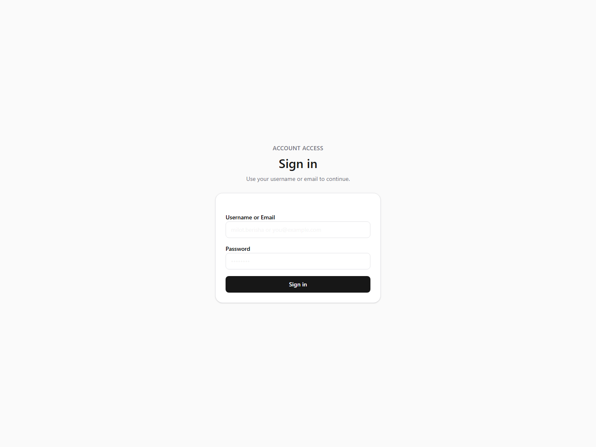

- File: `screenshots/auth-login.png`

### 1.2 Set Password / Reset Password

- **Route:** `/auth/setup-password`
- **Who uses it:** invited users and users following a password reset email
- **Page purpose:** first-time password setup and later password reset
- **Main actions:**
  - accept invite link
  - create password
  - confirm password

### Field reference

- **Password**: new password for the account
- **Confirm Password**: must match the password field

### Notes

- The user must arrive from an email link that establishes an auth session.
- Current minimum rule is 8 characters.
- Future hardening should add stronger password policy and optional 2FA.

### Screenshot slot

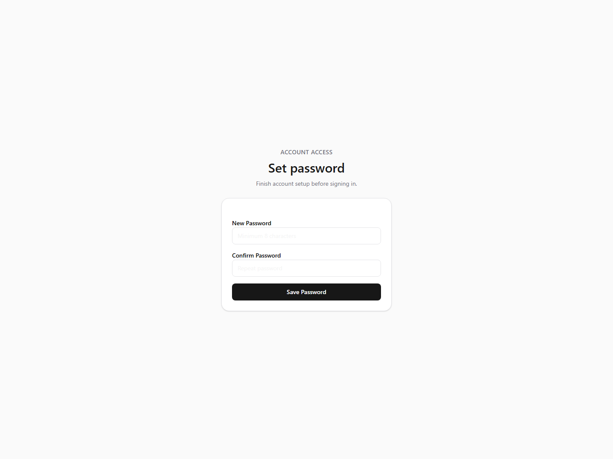

- File: `screenshots/auth-setup-password.png`

---

## 2. Dashboard

### 2.1 Operational Dashboard

- **Route:** `/`
- **Who uses it:** all signed-in users
- **Page purpose:** first-screen operational overview

### Admin / Office dashboard shows

- open work
- blocked tasks
- overdue tasks
- active and prepared contracts
- issued and draft invoices
- current month spend
- client/property counts
- recent tasks
- recent expenses
- recent contracts
- recent invoices
- recent clients
- recent properties

### Field / Contractor dashboard shows

- their open work
- blocked tasks
- overdue tasks
- recent assigned tasks
- property register pulse

### Main actions

- open tasks
- create expense
- create contract
- move into billing, expenses, properties, or tasks

### Screenshot slots

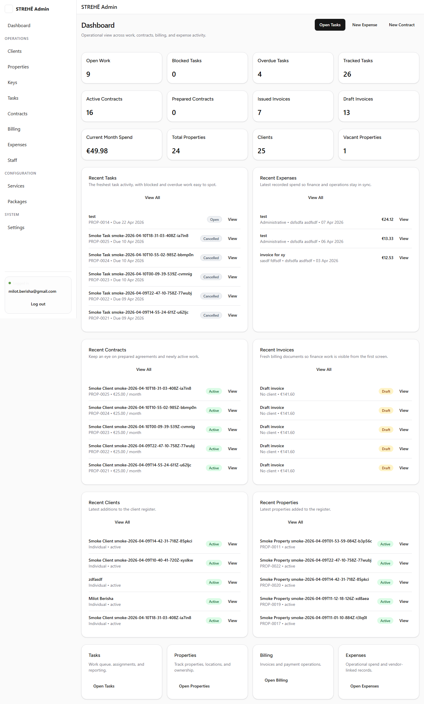

- File: `screenshots/dashboard-admin.png`
- `screenshots/dashboard-field.png`

_Pending capture: the current dataset does not include an active `field` or `contractor` user, so this role-specific dashboard screenshot still needs to be generated once that account exists._

---

## 3. Clients

### 3.1 Clients List

- **Route:** `/clients`
- **Who uses it:** admin, office
- **Page purpose:** registry of individual and business clients
- **Main actions:**
  - search/browse clients
  - open a client
  - create a client
  - review status and type mix

### Key list information

- total clients
- active clients
- individuals
- businesses

### Screenshot slot

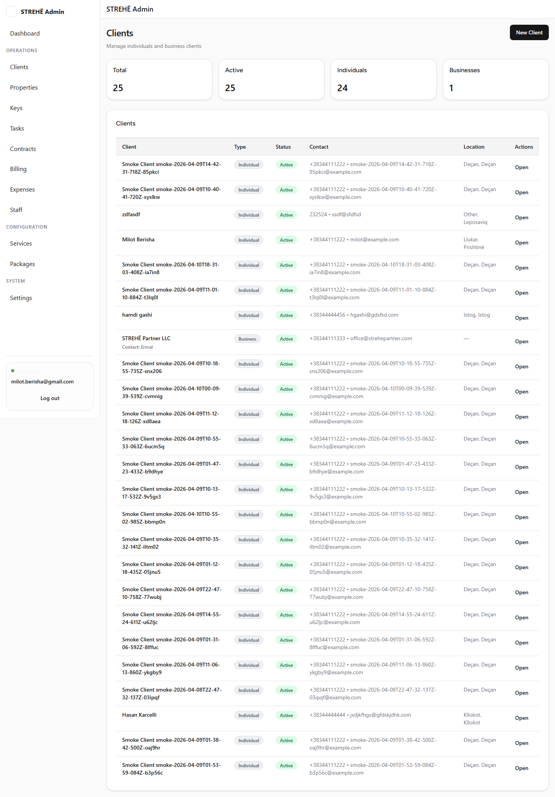

- File: `screenshots/clients-list.png`

### 3.2 New Client

- **Route:** `/clients/new`
- **Who uses it:** admin, office
- **Page purpose:** create a new individual or business client

### Field reference

#### General

- **Client Type**: `Individual` or `Business`
- **Status**: `Active` or `Inactive`

#### Client Details

If `Individual`:
- **Full Name**

If `Business`:
- **Company Name**
- **Contact Person**

#### Contact

- **Phone**
- **Email**

#### Address

- **Address Line 1**
- **Address Line 2**
- **Municipality**
- **Location**
- **Country**

#### Notes

- **Notes**: free-form internal notes

### Important behavior

- The selected location must belong to the selected municipality.
- This is enforced server-side, not only in the UI.

### Screenshot slot

- File: `screenshots/clients-new.png`

### 3.3 Client Detail

- **Route:** `/clients/[id]`
- **Who uses it:** admin, office
- **Page purpose:** turn a client into an operational hub, not just a contact card

### Main sections

- summary/header
- contact
- address
- notes
- owned properties
- contracts
- recent tasks
- meta/system information

### Main actions

- edit client
- create a new property for this client
- navigate into related properties/contracts/tasks

### Screenshot slot

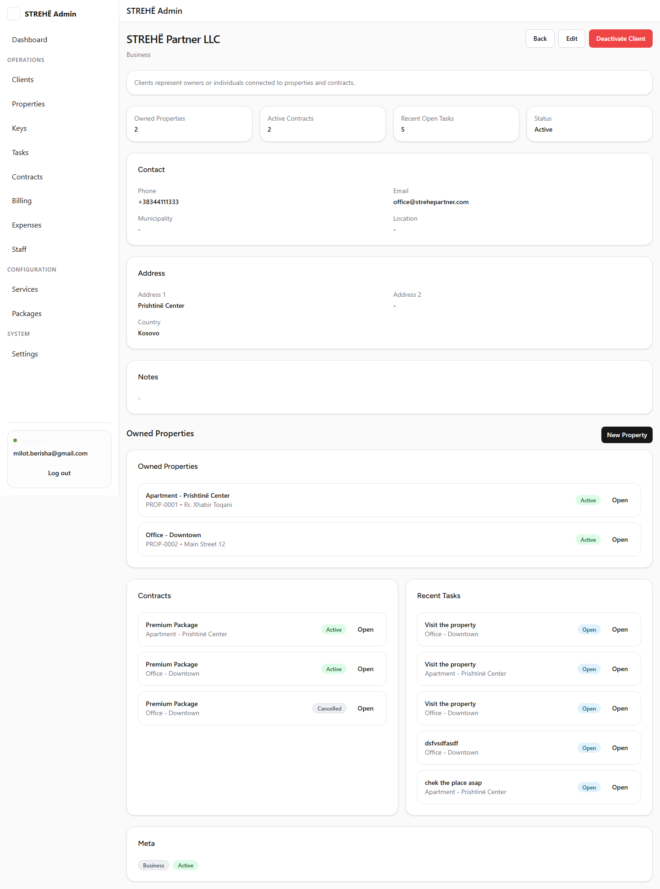

- File: `screenshots/clients-detail.png`

### 3.4 Edit Client

- **Route:** `/clients/[id]/edit`
- **Who uses it:** admin, office
- **Page purpose:** update a client record

### Field reference

Same fields as **New Client**, prefilled with current values.

### Screenshot slot

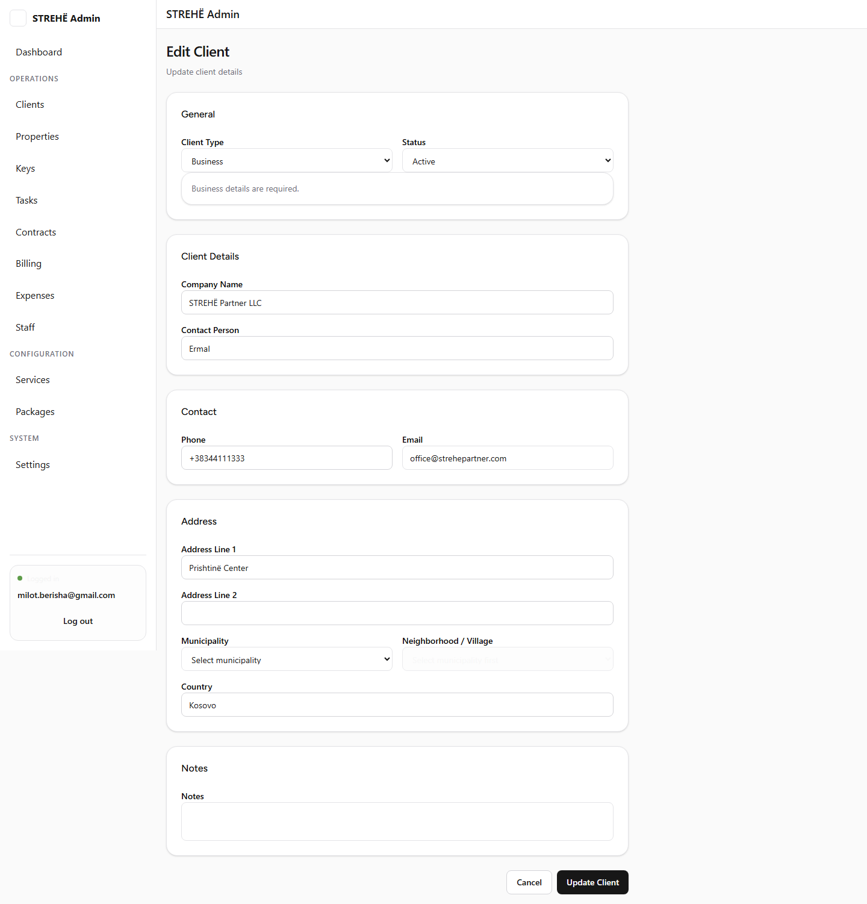

- File: `screenshots/clients-edit.png`

---

## 4. Properties

### 4.1 Properties List

- **Route:** `/properties`
- **Who uses it:** admin, office
- **Page purpose:** central property register

### Main actions

- search by title/code/address
- filter by municipality
- filter by owner
- filter by status
- open property detail
- create new property

### Summary cards

- total properties
- active
- vacant
- inactive

### Screenshot slot

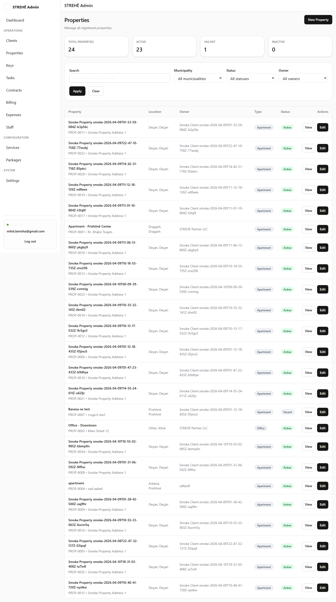

- File: `screenshots/properties-list.png`

### 4.2 New Property

- **Route:** `/properties/new`
- **Who uses it:** admin, office
- **Page purpose:** register a property and tie it to its owner

### Field reference

- **Property Code**: display-only, auto-generated by the system
- **Title**: human-friendly recognisable property name
- **Owner**: required client owner
- **Municipality**: required
- **Location**: required and must belong to the selected municipality
- **Address Line 1**
- **Address Line 2**
- **Country**
- **Property Type**: apartment, house, office, shop, land
- **Status**: active, vacant, inactive, under maintenance

### Important behavior

- Ownership is required at creation.
- Municipality/location consistency is validated server-side.

### Screenshot slot

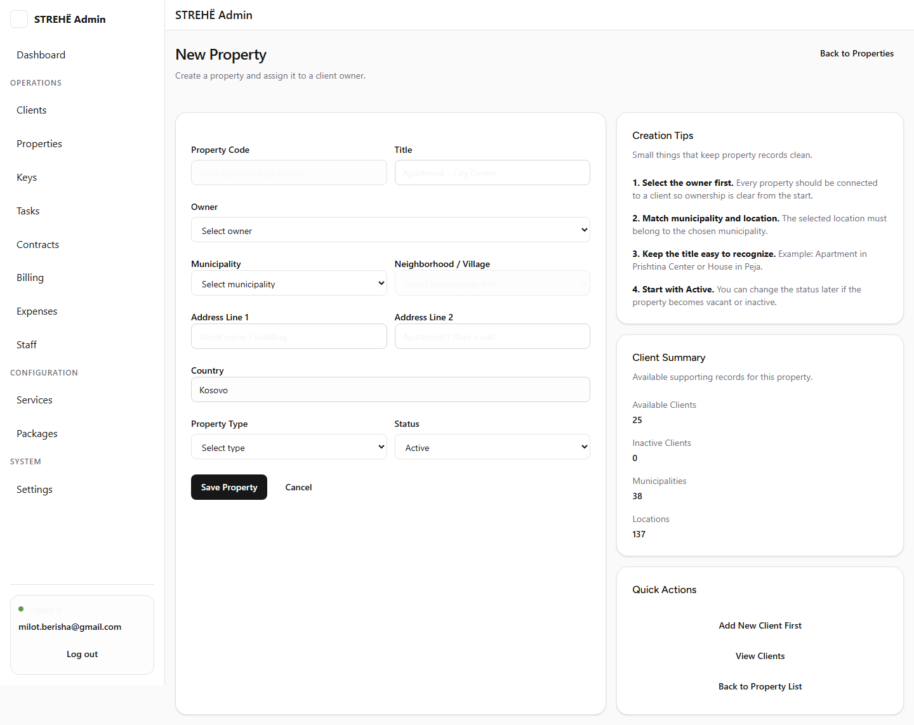

- File: `screenshots/properties-new.png`

### 4.3 Property Detail

- **Route:** `/properties/[id]`
- **Who uses it:** admin, office
- **Page purpose:** full operational/property identity page

### Typical content

- property summary
- owner
- address and geographic details
- status and type
- related keys
- related contract context

### Main actions

- edit property
- manage property keys

### Screenshot slot

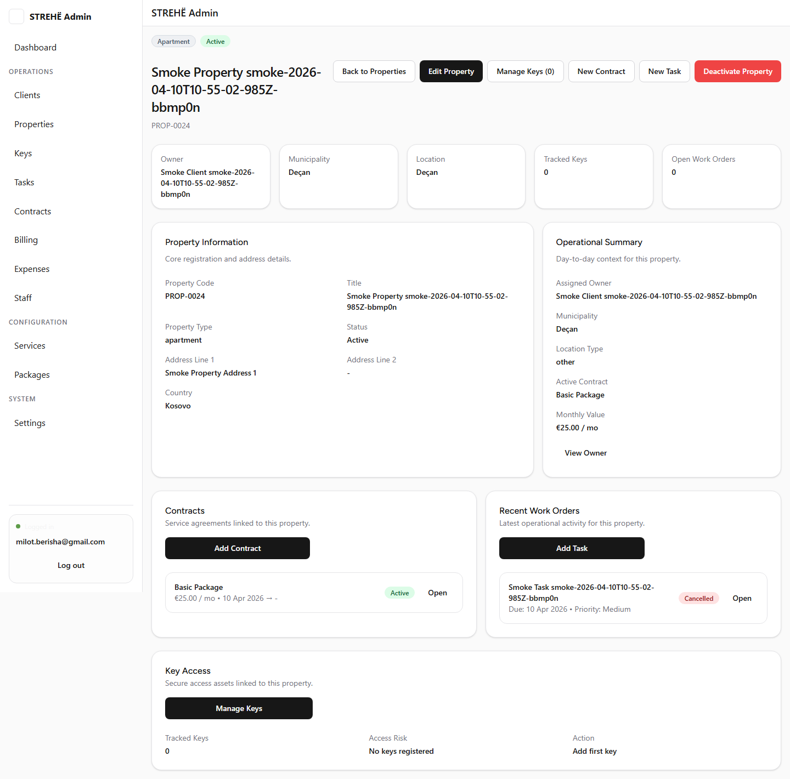

- File: `screenshots/properties-detail.png`

### 4.4 Edit Property

- **Route:** `/properties/[id]/edit`
- **Who uses it:** admin, office
- **Page purpose:** correct ownership, status, or address data

### Field reference

Same core fields as **New Property**, prefilled.

### Screenshot slot

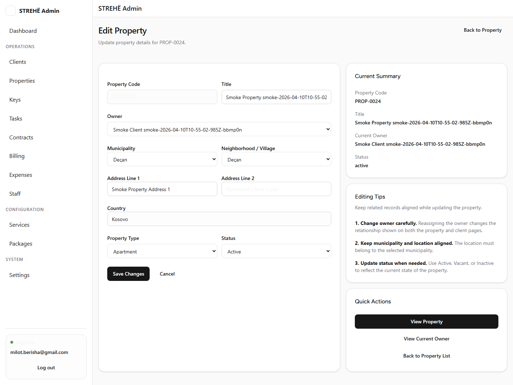

- File: `screenshots/properties-edit.png`

### 4.5 Property Keys

- **Route:** `/properties/[id]/keys`
- **Who uses it:** admin, office, sometimes field for visibility
- **Page purpose:** view keys registered for one property

### Main actions

- review available vs assigned keys
- add a new property key
- open key detail

### Screenshot slot

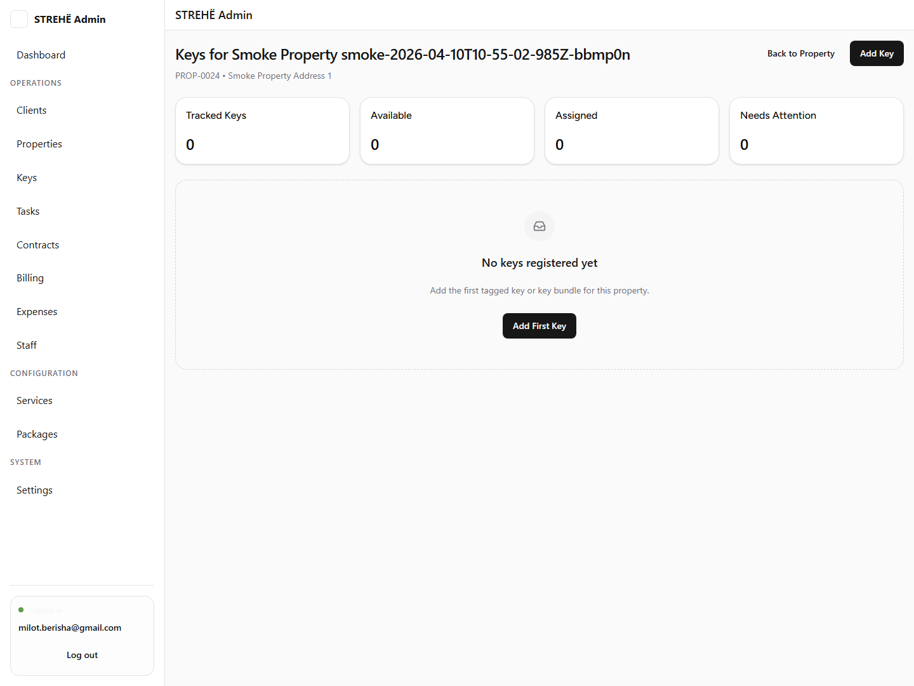

- File: `screenshots/properties-keys-list.png`

### 4.6 Add Property Key

- **Route:** `/properties/[id]/keys/new`
- **Who uses it:** admin, office
- **Page purpose:** register a new key for a property

### Field reference

- **Key Type**
- **Storage Location**
- **Key Name**
- **Description**

### Screenshot slot

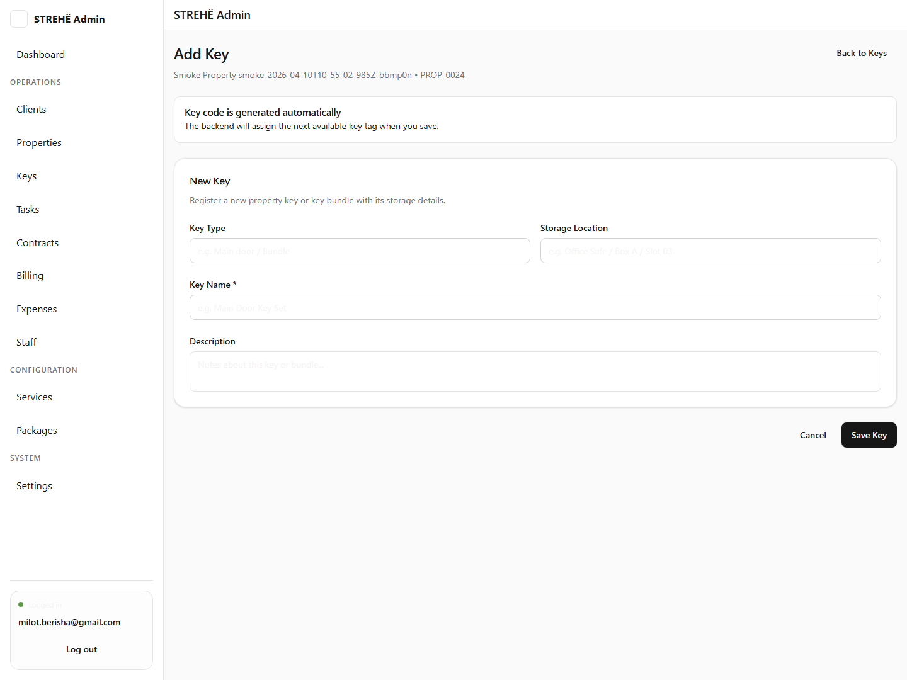

- File: `screenshots/properties-keys-new.png`

---

## 5. Tasks

### 5.1 Tasks List

- **Route:** `/tasks`
- **Who uses it:** admin, office, field, contractor
- **Page purpose:** operational work queue

### Main actions

- filter by status
- filter by priority
- filter by assignee
- filter by due state
- filter by property
- search by title
- create new task
- open task detail

### Key summary signals

- open tasks
- in progress
- blocked
- overdue
- source awareness (manual vs subscription)

### Screenshot slot

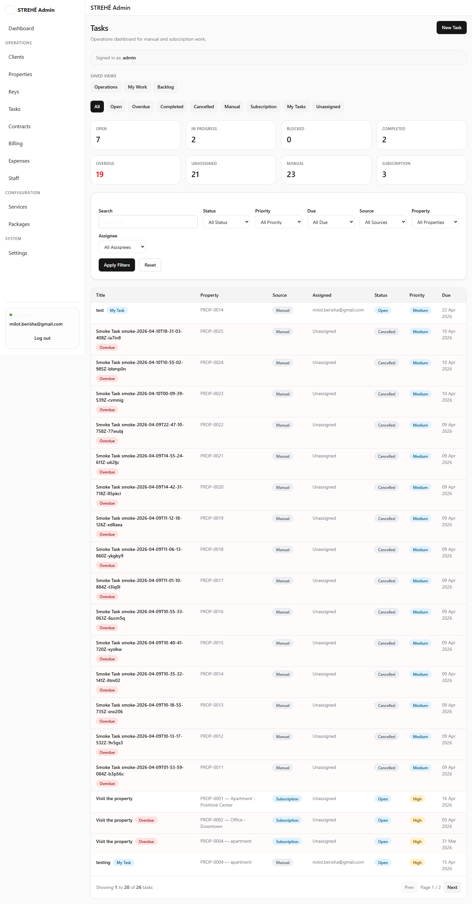

- File: `screenshots/tasks-list.png`

### 5.2 Create Task

- **Route:** `/tasks/create`
- **Who uses it:** admin, office
- **Page purpose:** create manual work items

### Field reference

- **Title**
- **Description**
- **Status**: open, in progress, blocked, cancelled, completed
- **Priority**: low, medium, high, urgent
- **Assign To**
- **Due Date**
- **Property**
- **Blocked Reason**: required if status is blocked
- **Cancellation Reason**: required if status is cancelled

### Screenshot slot

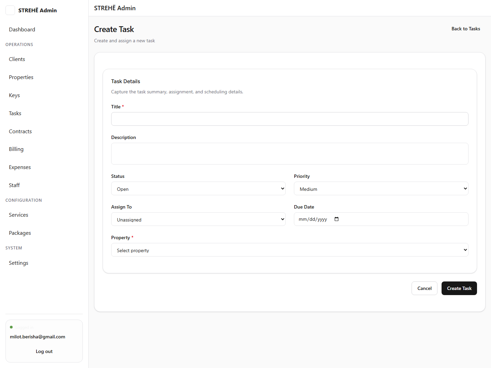

- File: `screenshots/tasks-new.png`

### 5.3 Task Detail

- **Route:** `/tasks/[id]`
- **Who uses it:** all operational roles depending on assignment/permission
- **Page purpose:** full task workflow page

### Main actions

- review task state
- change status
- assign/reassign
- see blocked/cancelled reasons
- review reports
- navigate to edit/report flows

### Screenshot slot

- File: `screenshots/tasks-detail.png`

### 5.4 Edit Task

- **Route:** `/tasks/[id]/edit`
- **Who uses it:** admin, office
- **Page purpose:** change task configuration

### Field reference

Same as **Create Task**, prefilled with current values.

### Screenshot slot

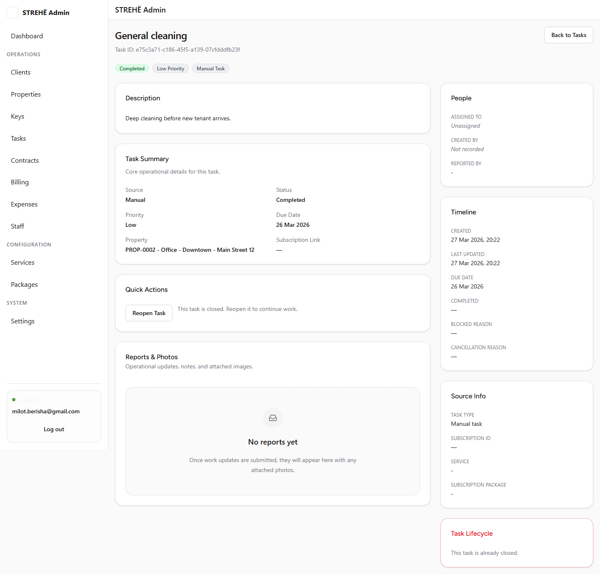

- File: `screenshots/tasks-edit.png`

### 5.5 Add Task Report

- **Route:** `/tasks/[id]/report`
- **Who uses it:** assignees and operational staff
- **Page purpose:** submit execution updates and closure evidence

### Typical expected inputs

- report text / work update
- optional attachments or photos
- completion-related notes

### Screenshot slot

- File: `screenshots/tasks-report.png`

---

## 6. Keys

### 6.1 Keys List

- **Route:** `/keys`
- **Who uses it:** admin, office; view visibility may extend to other roles
- **Page purpose:** cross-property key operations page

### Main actions

- filter/find keys
- review available, assigned, lost, damaged, retired counts
- open key detail

### Screenshot slot

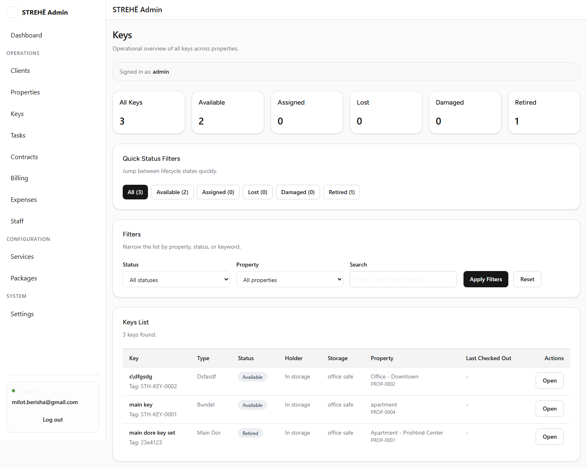

- File: `screenshots/keys-list.png`

### 6.2 Key Detail

- **Route:** `/keys/[id]`
- **Who uses it:** admin, office for mutation; others may have read-only visibility
- **Page purpose:** custody and audit page for one key

### Main actions

- assign key
- return key
- mark lost
- mark damaged
- retire key
- review full key history

### Key data shown

- key tag
- key type
- current holder
- last checked out
- property summary
- audit trail

### Screenshot slot

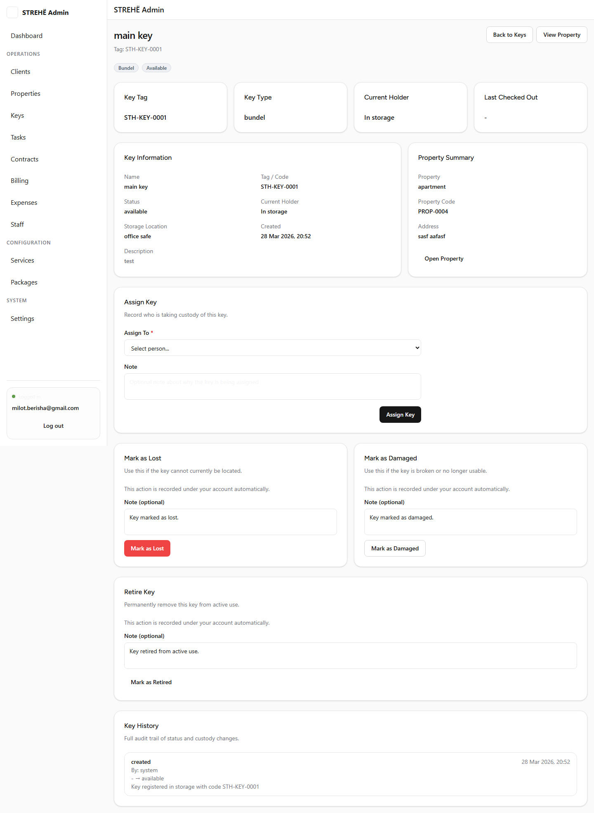

- File: `screenshots/keys-detail.png`

---

## 7. Contracts / Subscriptions

### 7.1 Contracts List

- **Route:** `/subscriptions`
- **Who uses it:** admin
- **Page purpose:** manage service agreements for properties and owners

### Main actions

- review contract states
- create contract
- open contract detail

### Summary cards

- total
- draft
- prepared
- active
- paused
- cancelled
- monthly revenue

### Screenshot slot

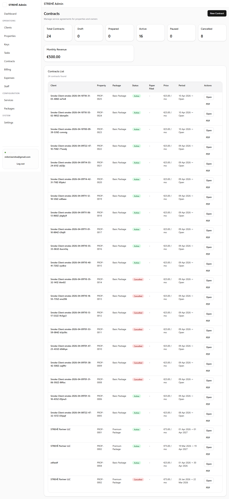

- File: `screenshots/contracts-list.png`

### 7.2 New Contract

- **Route:** `/subscriptions/create`
- **Who uses it:** admin
- **Page purpose:** create the source contract record that future scheduling reads

### Field reference

- **Client**
- **Property**: only free properties for that client
- **Package**
- **Monthly Price**: auto-filled from package
- **Start Date**
- **End Date**
- **Status**: draft, prepared, paused, cancelled
- **Notes**

### Important behavior

- A property must belong to the selected client.
- A property cannot already have an active or paused contract.
- A contract is not directly `active` at creation; physical confirmation later activates it.

### Screenshot slot

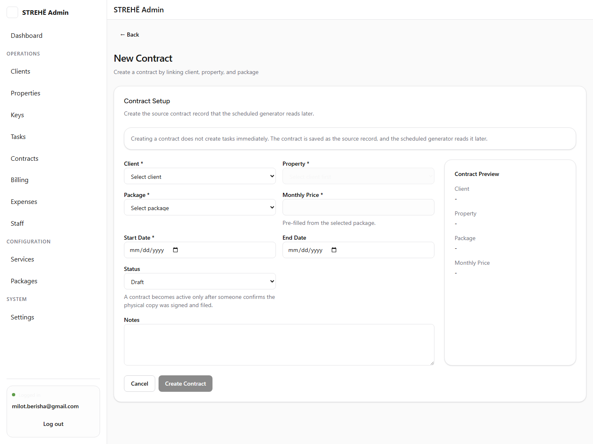

- File: `screenshots/contracts-new.png`

### 7.3 Contract Detail

- **Route:** `/subscriptions/[id]`
- **Who uses it:** admin
- **Page purpose:** lifecycle, package, and operational source view for a contract

### Main sections

- status
- paper filed state
- contract price and package price
- contract details
- property details
- package details
- included services
- notes
- system info

### Main actions

- edit contract
- confirm signed and filed physical contract
- cancel/pause/reopen depending on state
- open contract PDF

### Screenshot slot

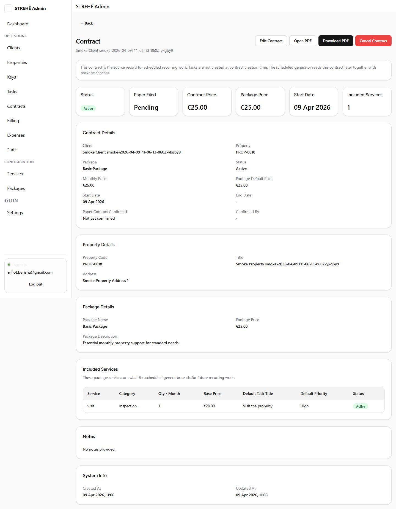

- File: `screenshots/contracts-detail.png`

### 7.4 Edit Contract

- **Route:** `/subscriptions/[id]/edit`
- **Who uses it:** admin
- **Page purpose:** edit the saved source contract

### Field reference

- **Client**
- **Property**
- **Package**
- **Monthly Price**
- **Start Date**
- **End Date**
- **Status**
- **Notes**

### Screenshot slot

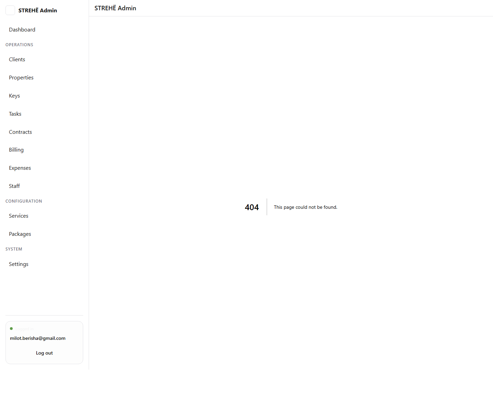

- File: `screenshots/contracts-edit.png`

---

## 8. Billing

### 8.1 Invoices List

- **Route:** `/billing`
- **Who uses it:** admin, office
- **Page purpose:** billing document register

### Main actions

- create invoice
- review issued vs draft
- open invoice

### Summary cards

- total documents
- issued
- drafts
- total volume

### Screenshot slot

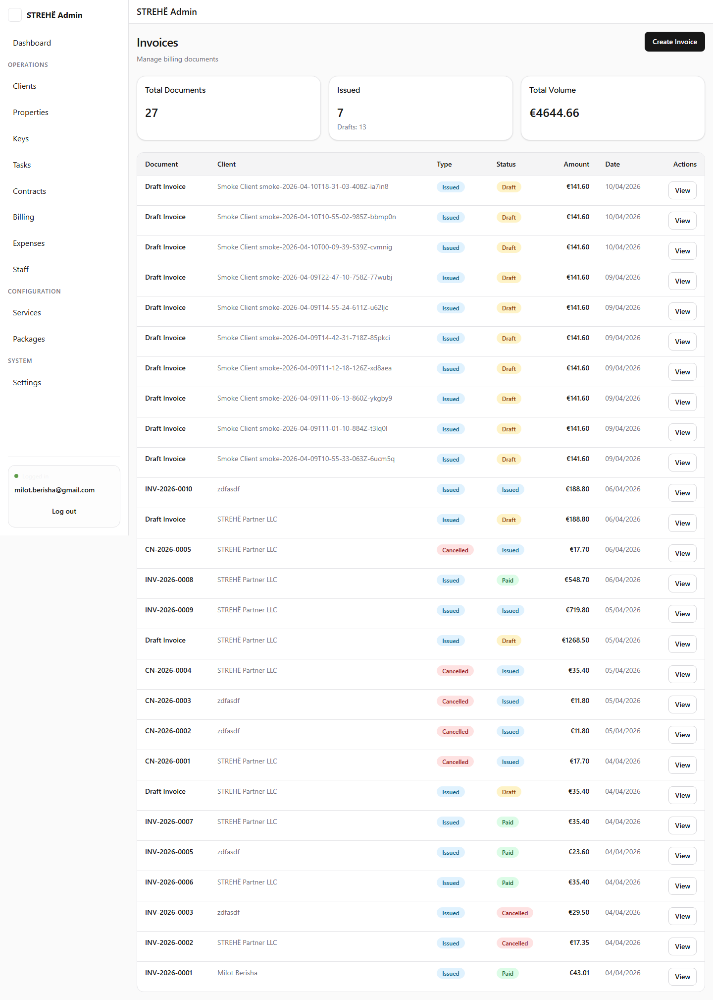

- File: `screenshots/billing-list.png`

### 8.2 New Invoice

- **Route:** `/billing/new`
- **Who uses it:** admin, office
- **Page purpose:** create an invoice tied to a client and eligible property

### Field reference

- **Client**
- **Property**: only active subscription-linked properties for that client
- **Invoice Date**
- **Due Date**
- **Line Items**:
  - description
  - quantity
  - unit price
  - VAT rate
- **Notes**

### Calculated values

- subtotal
- VAT
- total

### Screenshot slot

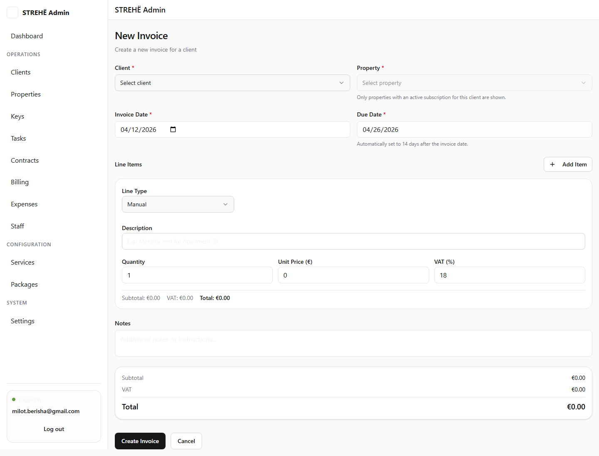

- File: `screenshots/billing-new.png`

### 8.3 Invoice Detail

- **Route:** `/billing/[id]`
- **Who uses it:** admin, office
- **Page purpose:** full billing document review page

### Main sections

- from
- bill to
- document details
- financial summary
- line items
- credit notes
- payments
- notes

### Main actions

- edit draft invoice
- update invoice status
- record payment
- create credit note
- download/open PDF

### Screenshot slot

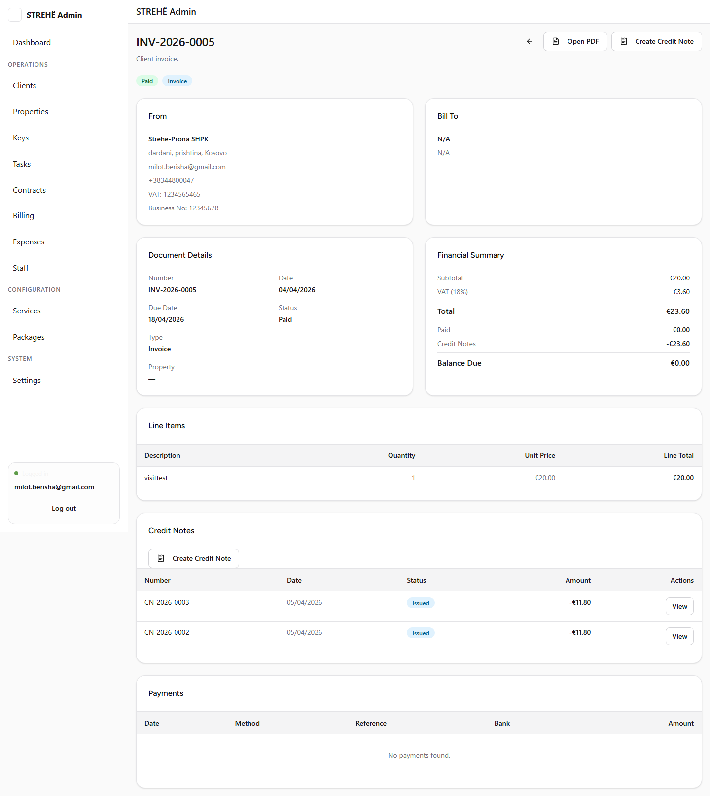

- File: `screenshots/billing-detail.png`

### 8.4 Edit Invoice

- **Route:** `/billing/[id]/edit`
- **Who uses it:** admin, office
- **Page purpose:** correct a draft invoice

### Field reference

Same core fields as **New Invoice**.

### Screenshot slot

- File: `screenshots/billing-edit.png`

### 8.5 Record Payment

- **Route:** `/billing/[id]/payment`
- **Who uses it:** admin, office
- **Page purpose:** register money received against an invoice

### Field reference

- **Amount (€)**
- **Payment Method**: bank transfer or cash
- **Bank**: required when payment method is bank transfer
- **Reference Number**
- **Notes**

### Screenshot slot

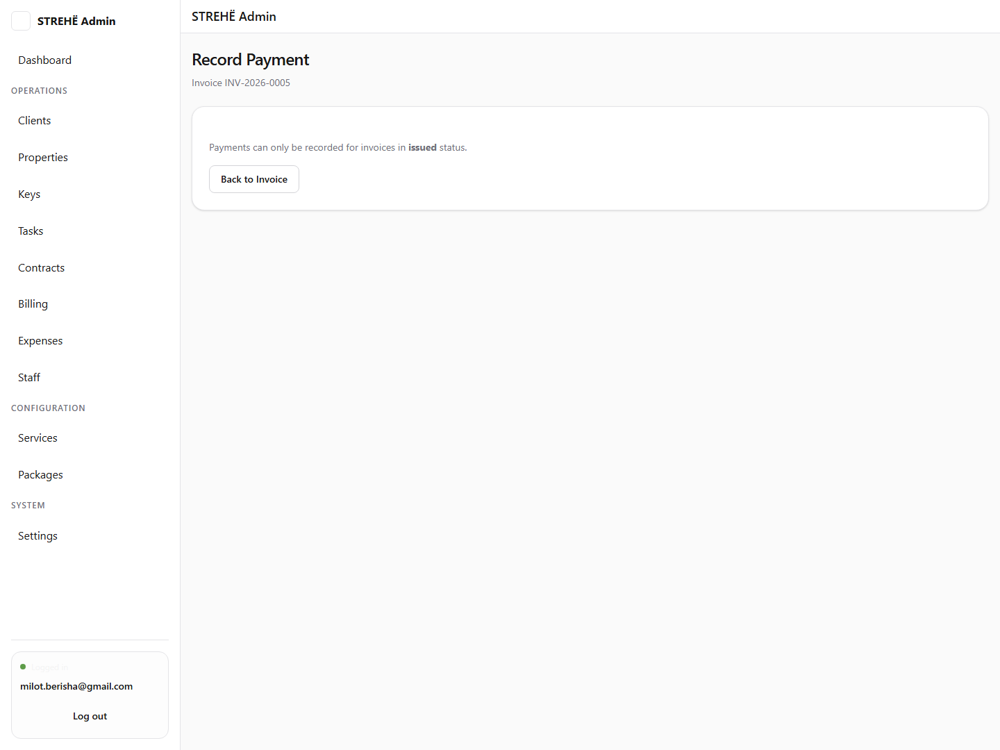

- File: `screenshots/billing-record-payment.png`

### 8.6 Payment History

- **Route:** `/billing/payments`
- **Who uses it:** admin, office
- **Page purpose:** cross-invoice payment ledger

### Main actions

- review all recorded payments
- inspect invoice-linked payment history

### Screenshot slot

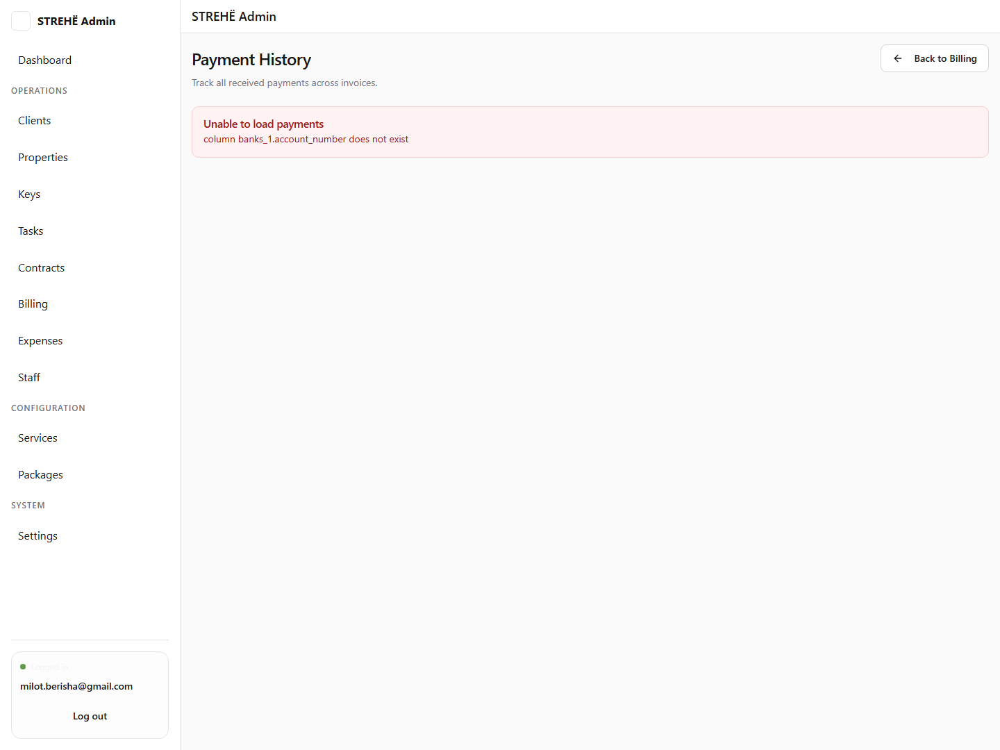

- File: `screenshots/billing-payments-history.png`

### 8.7 New Credit Note

- **Route:** `/billing/[id]/credit-note/new`
- **Who uses it:** admin, office
- **Page purpose:** create a credit note against an invoice

### Screenshot slot

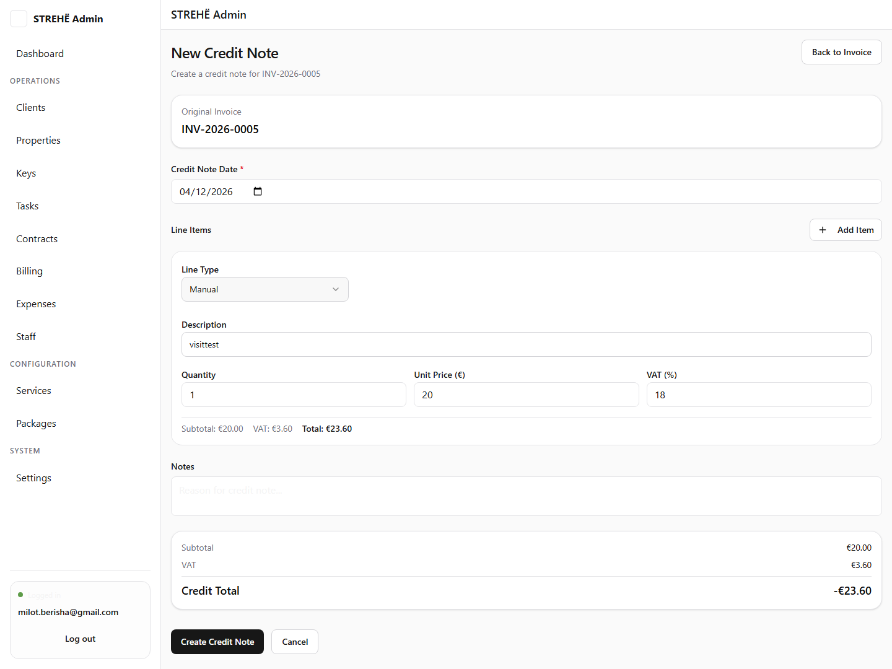

- File: `screenshots/billing-credit-note-new.png`

---

## 9. Expenses

### 9.1 Expenses List

- **Route:** `/expenses`
- **Who uses it:** admin, office
- **Page purpose:** manual operational expense tracking

### Main actions

- filter by category
- filter by vendor
- filter by property
- filter by date range
- free-text search
- open expense
- edit expense
- create expense

### Summary cards

- total records
- filtered records
- filtered spend
- current month spend

### Screenshot slot

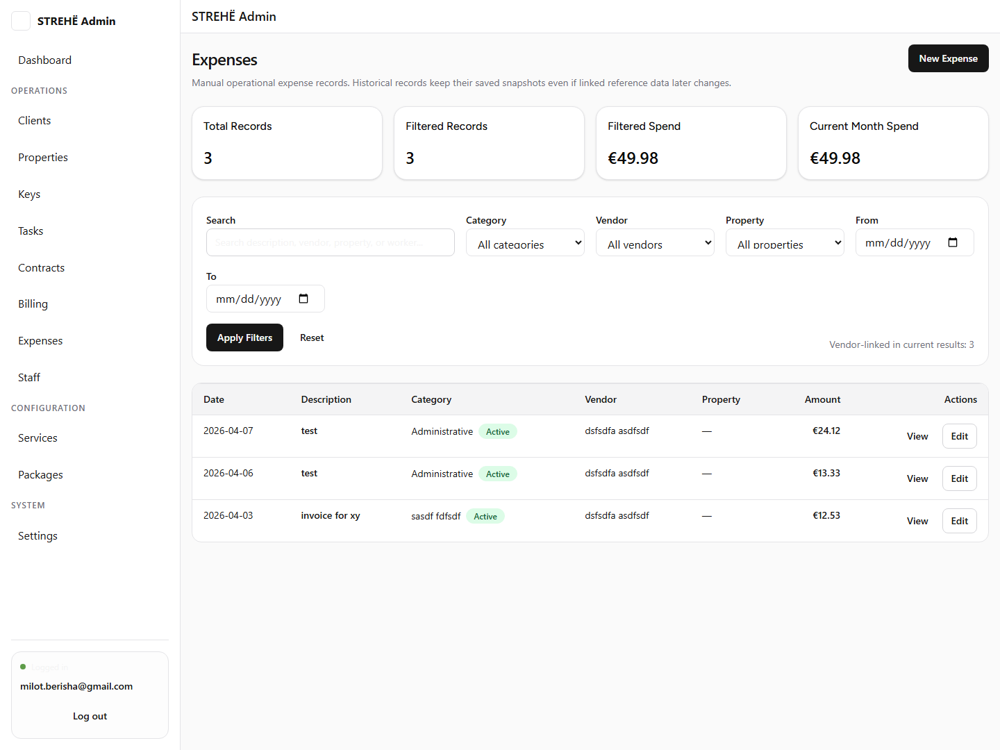

- File: `screenshots/expenses-list.png`

### 9.2 New Expense

- **Route:** `/expenses/new`
- **Who uses it:** admin, office
- **Page purpose:** log a new operational expense

### Field reference

- **Expense Date**
- **Amount**
- **Description**
- **Worker**
- **Category**
- **Vendor**
- **Property**
- **Notes**

### Important behavior

- Only active categories are selectable for new expenses.
- Amount is entered as a decimal value and stored internally as cents.

### Screenshot slot

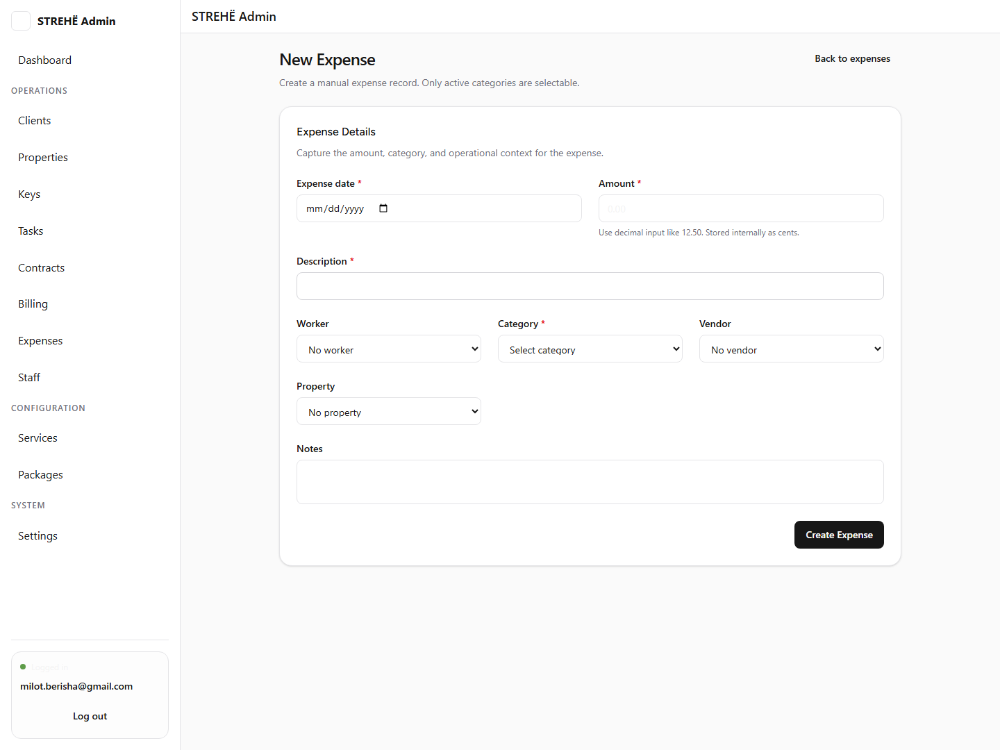

- File: `screenshots/expenses-new.png`

### 9.3 Expense Detail

- **Route:** `/expenses/[id]`
- **Who uses it:** admin, office
- **Page purpose:** read-only financial and operational snapshot of an expense

### Main sections

- expense ID
- amount
- expense date
- description
- category
- vendor
- property
- worker
- created at
- notes

### Main actions

- edit expense

### Screenshot slot

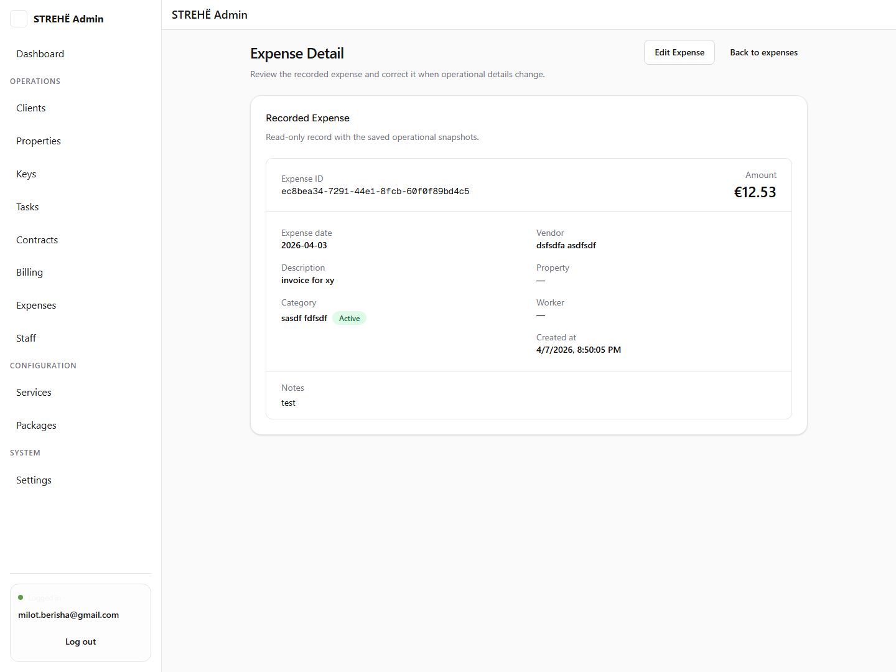

- File: `screenshots/expenses-detail.png`

### 9.4 Edit Expense

- **Route:** `/expenses/[id]/edit`
- **Who uses it:** admin, office
- **Page purpose:** correct an expense record

### Field reference

Same as **New Expense**.

### Important behavior

- Historical expenses tied to an inactive category can still preserve that category during editing.

### Screenshot slot

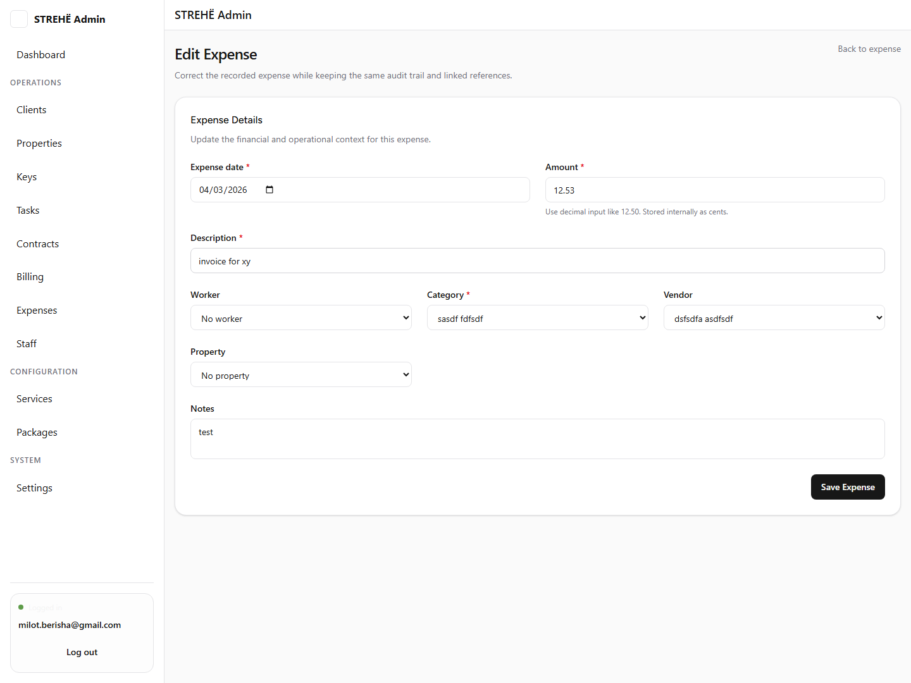

- File: `screenshots/expenses-edit.png`

---

## 10. Finance

### 10.1 Finance Overview

- **Route:** `/finance`
- **Who uses it:** admin, office
- **Page purpose:** read-only operational finance view built from invoice settlement data

### Typical use

- monitor receivables
- review open balances
- inspect aging or unpaid exposure

### Screenshot slot

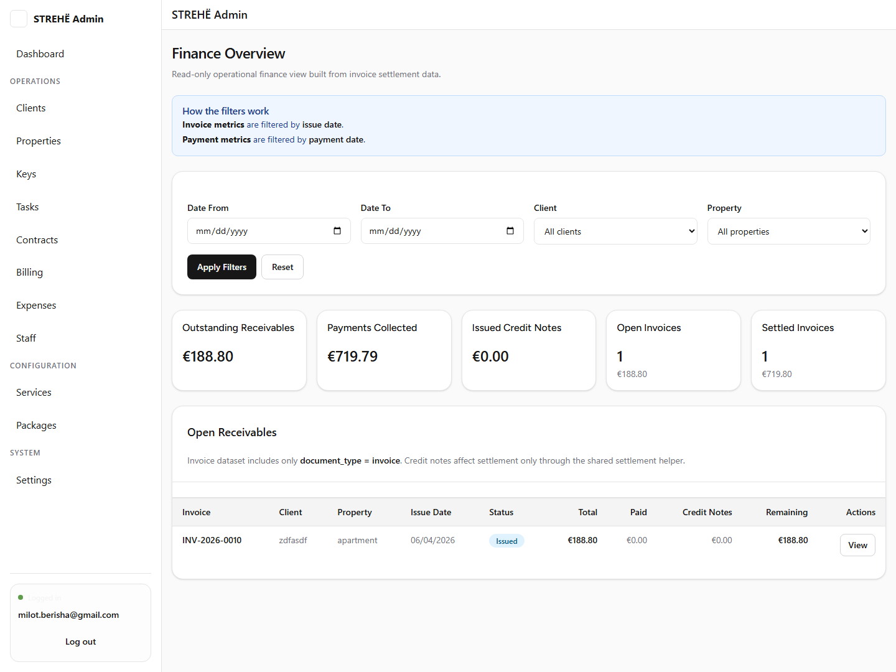

- File: `screenshots/finance-overview.png`

---

## 11. Services

### 11.1 Services List

- **Route:** `/services`
- **Who uses it:** admin, office
- **Page purpose:** reusable service catalog

### Main actions

- create service
- review active/inactive services
- open detail
- edit service

### Screenshot slot

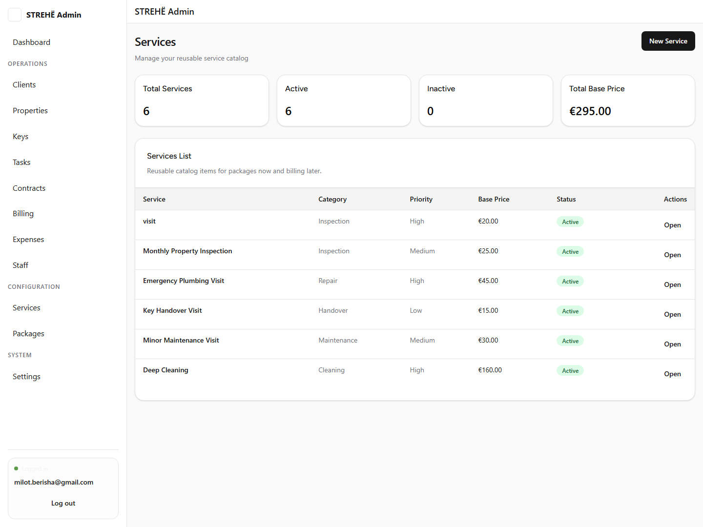

- File: `screenshots/services-list.png`

### 11.2 New Service

- **Route:** `/services/create`
- **Who uses it:** admin, office
- **Page purpose:** create a reusable service definition

### Field reference

- **Name**
- **Category**: inspection, maintenance, cleaning, repair, handover
- **Base Price**
- **Default Priority**
- **Default Task Title**
- **Default Task Description**
- **Status**
- **Description**

### Screenshot slot

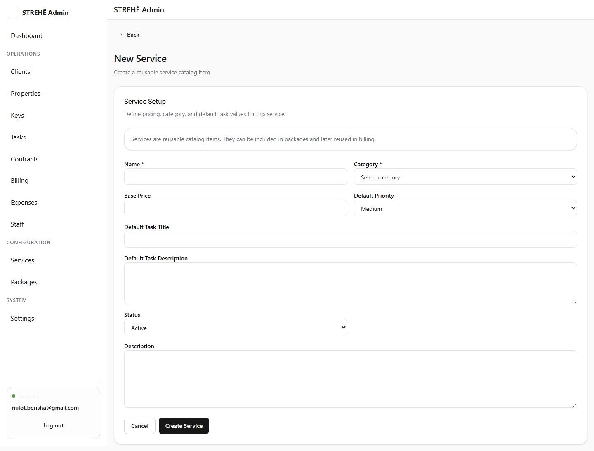

- File: `screenshots/services-new.png`

### 11.3 Service Detail

- **Route:** `/services/[id]`
- **Who uses it:** admin, office
- **Page purpose:** inspect the catalog definition and default task behavior

### Screenshot slot

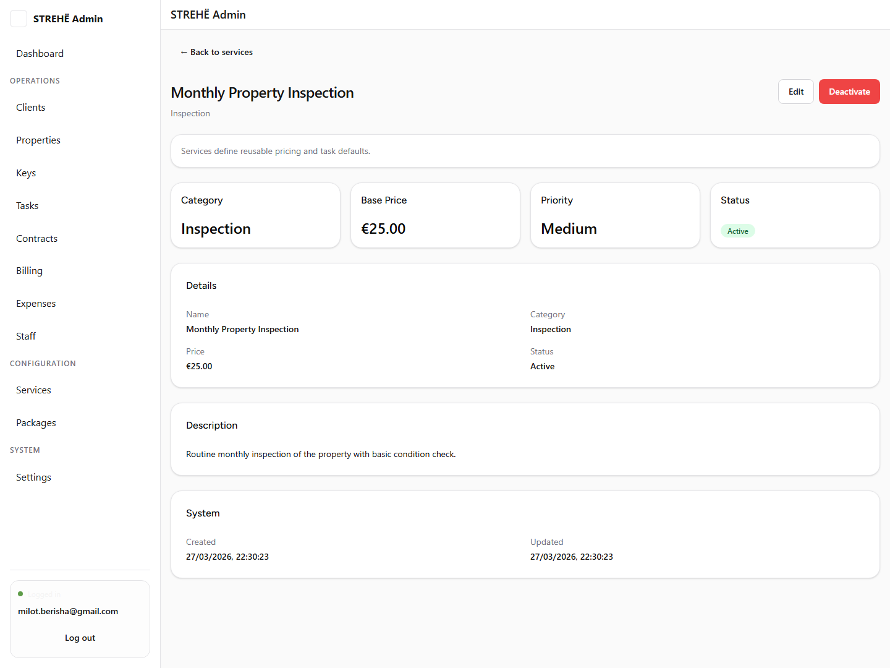

- File: `screenshots/services-detail.png`

### 11.4 Edit Service

- **Route:** `/services/[id]/edit`
- **Who uses it:** admin, office
- **Page purpose:** update service pricing and default behavior

### Field reference

Same as **New Service**.

### Screenshot slot

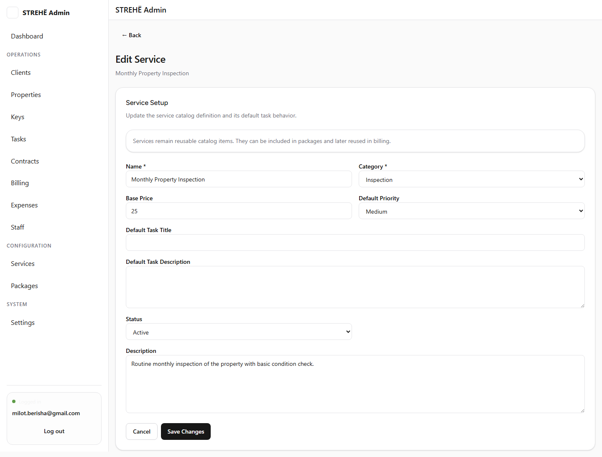

- File: `screenshots/services-edit.png`

---

## 12. Packages

### 12.1 Packages List

- **Route:** `/packages`
- **Who uses it:** admin, office
- **Page purpose:** commercial bundles used in contracts

### Main actions

- create package
- review active/inactive packages
- review active contract usage
- open detail

### Screenshot slot

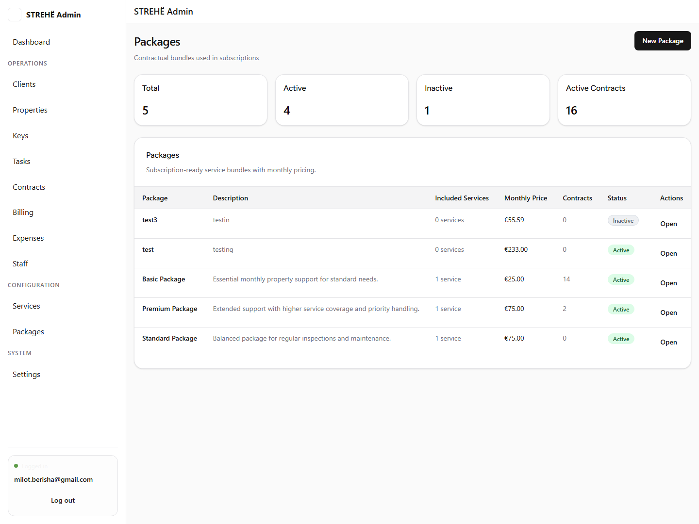

- File: `screenshots/packages-list.png`

### 12.2 New Package

- **Route:** `/packages/create`
- **Who uses it:** admin, office
- **Page purpose:** create a contractual/commercial package

### Field reference

- **Package Name**
- **Monthly Price**
- **Status**
- **Description**

### Screenshot slot

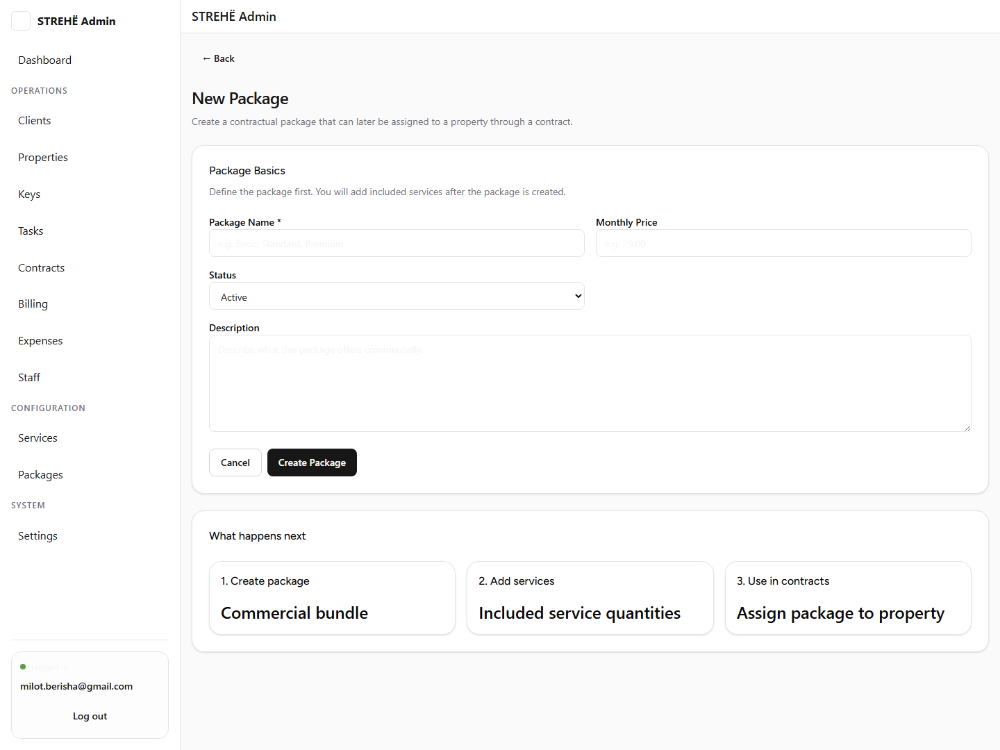

- File: `screenshots/packages-new.png`

### 12.3 Package Detail

- **Route:** `/packages/[id]`
- **Who uses it:** admin, office
- **Page purpose:** package summary and included services

### Screenshot slot

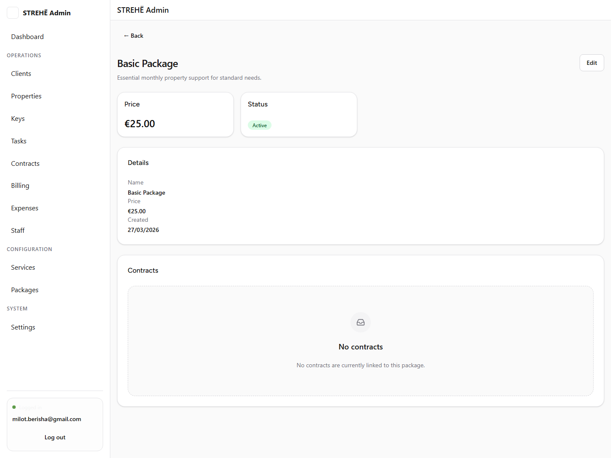

- File: `screenshots/packages-detail.png`

### 12.4 Edit Package

- **Route:** `/packages/[id]/edit`
- **Who uses it:** admin, office
- **Page purpose:** update package basics

### Field reference

Same as **New Package**.

### Screenshot slot

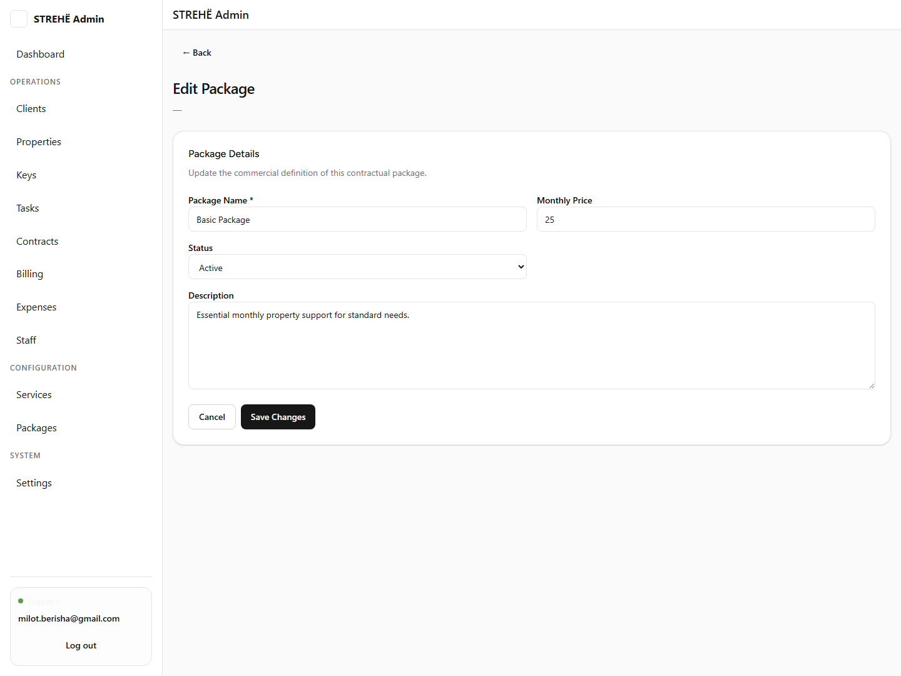

- File: `screenshots/packages-edit.png`

---

## 13. Staff / Workers

### 13.1 Staff List

- **Route:** `/workers`
- **Who uses it:** admin, office
- **Page purpose:** operational staff registry

### Main actions

- create staff record
- browse staff
- open detail

### Screenshot slot

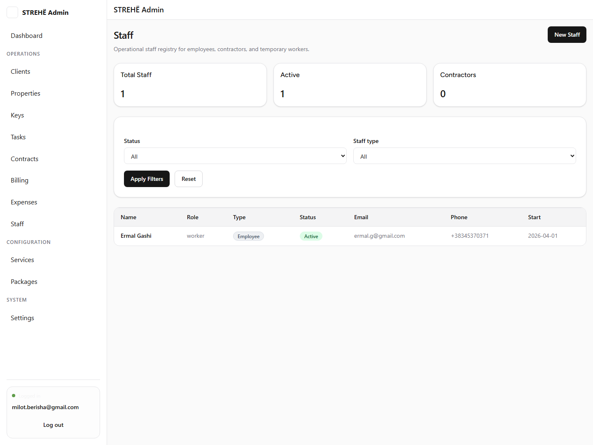

- File: `screenshots/workers-list.png`

### 13.2 New Staff Record

- **Route:** `/workers/new`
- **Who uses it:** admin, office
- **Page purpose:** create an employee/contractor/temporary record

### Field reference

#### Core

- **Full Name**
- **Personal ID**
- **Email**
- **Phone**

#### Employment

- **Role Title**
- **Worker Type**
- **Status**
- **Start Date**
- **End Date**

#### Compensation

- **Base Salary**
- **Payment Frequency**
- **Payment Method**
- **Bank Account**

#### Flags and Notes

- **Subject to Tax**
- **Subject to Pension**
- **Notes**

### Important behavior

- Bank account input is validated/detected against banking rules when available.
- Card-like numbers are flagged as invalid for this field.

### Screenshot slot

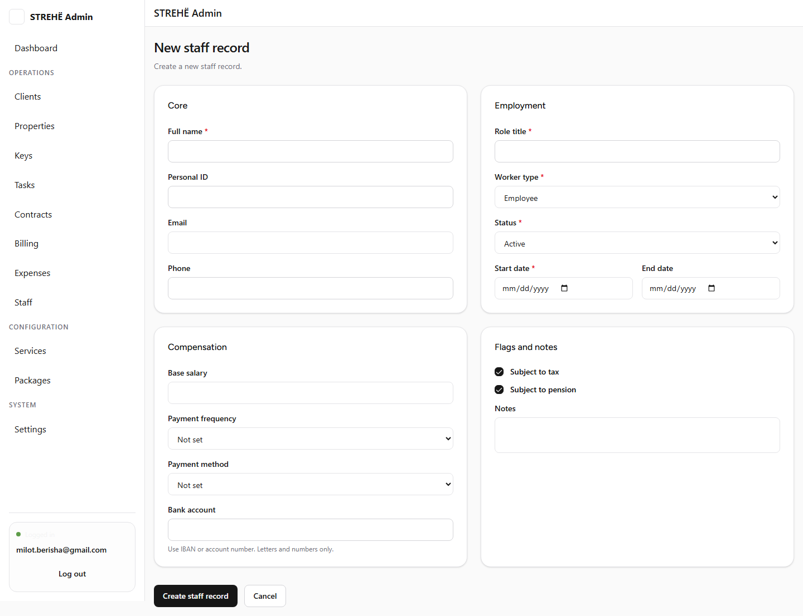

- File: `screenshots/workers-new.png`

### 13.3 Staff Detail

- **Route:** `/workers/[id]`
- **Who uses it:** admin, office
- **Page purpose:** read and edit one staff record

### Screenshot slot

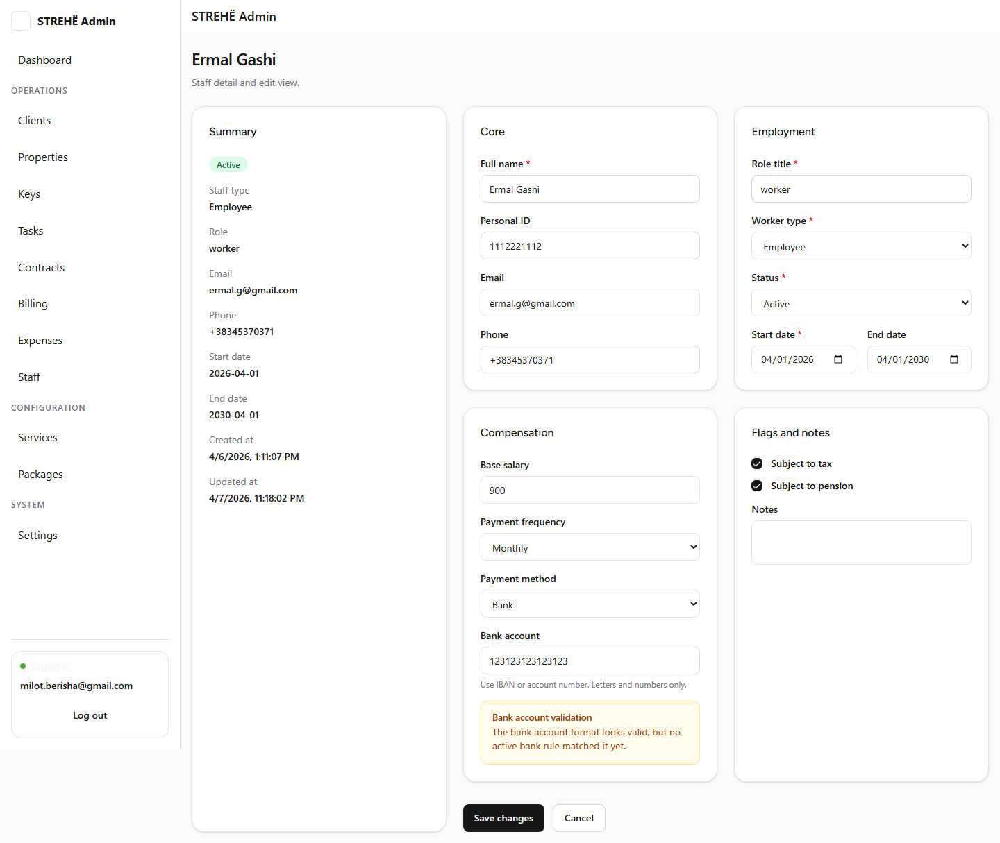

- File: `screenshots/workers-detail.png`

---

## 14. Settings (Admin)

### 14.1 Settings Hub

- **Route:** `/settings`
- **Who uses it:** admin
- **Page purpose:** central admin entry point to system configuration

### Cards in the hub

- General Settings
- Banking
- Users
- Expense Categories
- Vendors
- Appearance

### Screenshot slot

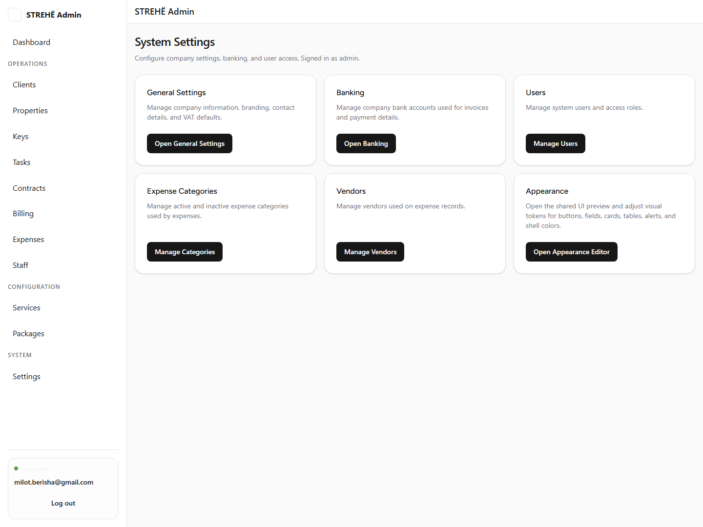

- File: `screenshots/settings-hub.png`

### 14.2 General Settings

- **Route:** `/settings/general`
- **Who uses it:** admin
- **Page purpose:** company identity, contact, tax, and branding

### Field reference

#### Company Information

- **Company Name**
- **VAT Number**
- **Currency**
- **VAT Rate**

#### Contact Details

- **Email**
- **Phone**

#### Address

- **Street Address**
- **City**
- **Country**

#### Branding

- **Company Logo**

#### Tax Settings

- **VAT enabled**

### Screenshot slot

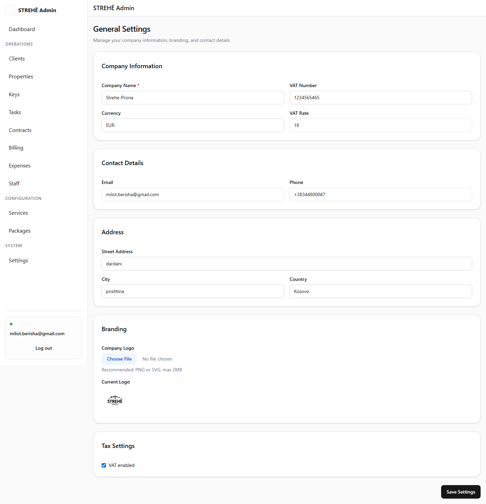

- File: `screenshots/settings-general.png`

### 14.3 Banking

- **Route:** `/settings/banking`
- **Who uses it:** admin
- **Page purpose:** manage company bank accounts and supporting bank-reference data

### Main sections

- company bank accounts
- licensed banks registry
- quick links to detection lab and create flows

### Summary cards

- active accounts
- primary accounts
- shown on invoices
- inactive accounts
- licensed banks
- active banks

### Screenshot slot

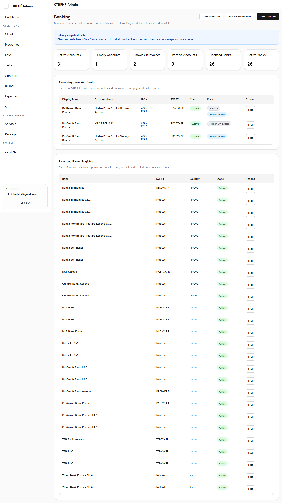

- File: `screenshots/settings-banking.png`

### 14.4 Add / Edit Company Bank Account

- **Routes:** `/settings/banking/new`, `/settings/banking/[id]`
- **Who uses it:** admin

### Field reference

- **Bank**
- **Account Name**
- **Display Bank Name**
- **IBAN**
- **SWIFT / BIC**
- **Set as primary account**
- **Show on invoice**

### Important behavior

- IBAN is validated and bank detection attempts to auto-fill bank/display/SWIFT.

### Screenshot slots

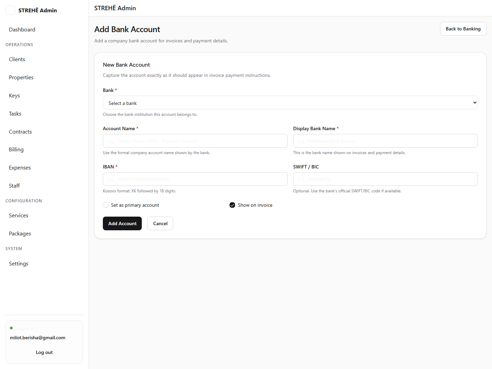

- File: `screenshots/settings-banking-account-new.png`
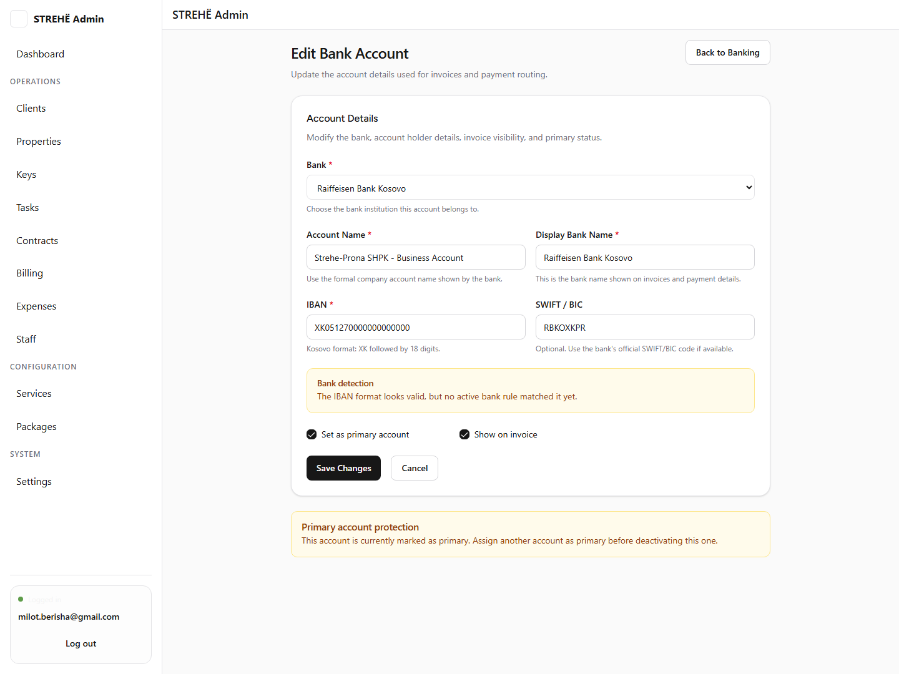

- File: `screenshots/settings-banking-account-edit.png`

### 14.5 Add / Edit Licensed Bank

- **Routes:** `/settings/banking/banks/new`, `/settings/banking/banks/[id]`
- **Who uses it:** admin

### Field reference

- **Bank Name**
- **Country**
- **SWIFT / BIC**

### Screenshot slots

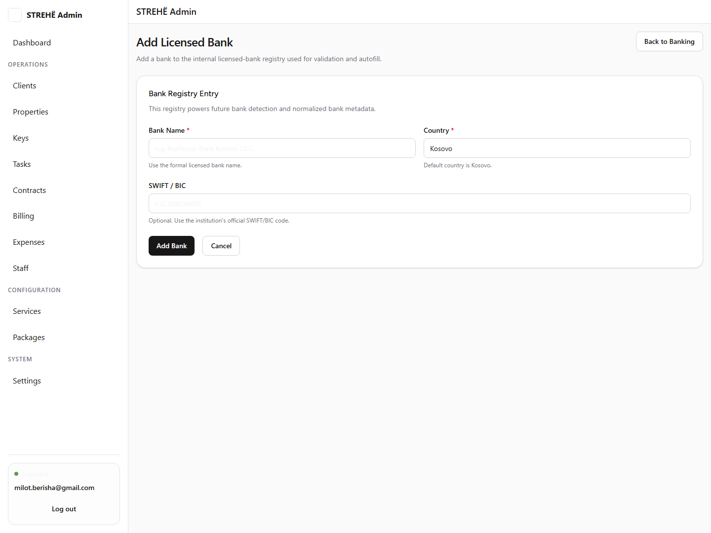

- File: `screenshots/settings-banking-bank-new.png`
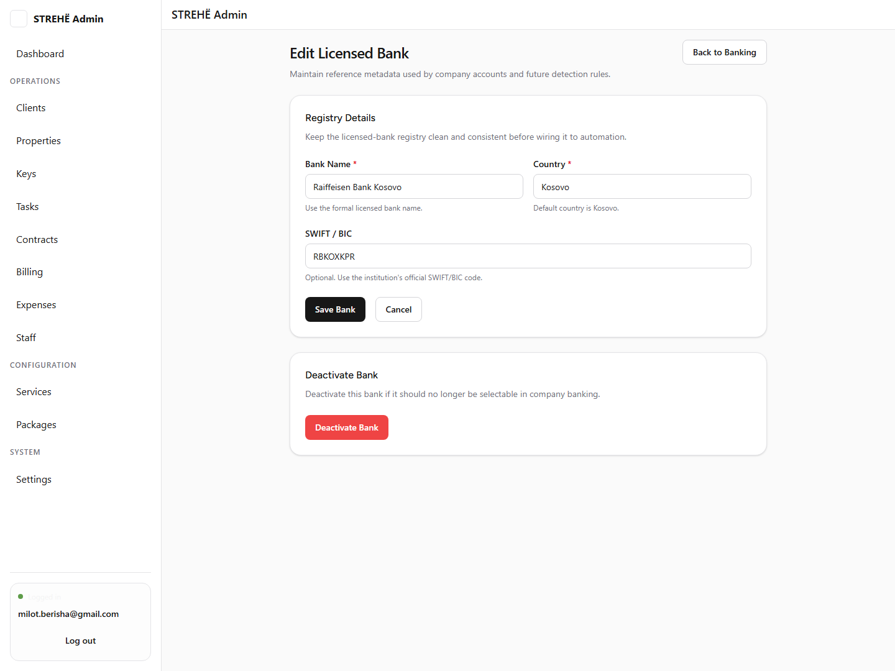

- File: `screenshots/settings-banking-bank-edit.png`

### 14.6 Bank Detection Lab

- **Route:** `/settings/banking/detection`
- **Who uses it:** admin
- **Page purpose:** internal rule management and testing for IBAN/account/card detection

### Main uses

- review total rules
- review IBAN/account/card BIN rule counts
- open/add/edit detection rules

### Screenshot slot

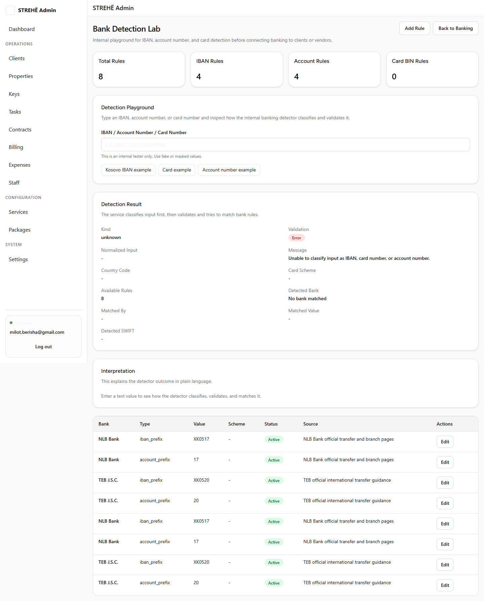

- File: `screenshots/settings-banking-detection.png`

### 14.7 Add / Edit Detection Rule

- **Routes:** `/settings/banking/detection/new`, `/settings/banking/detection/[id]`
- **Who uses it:** admin

### Field reference

- **Bank**
- **Rule Type**: IBAN prefix, account prefix, card BIN
- **Start Value**
- **End Value**
- **Card Scheme**
- **Country Code**
- **Priority**
- **Source**
- **Notes**
- **Rule is active**

### Screenshot slots

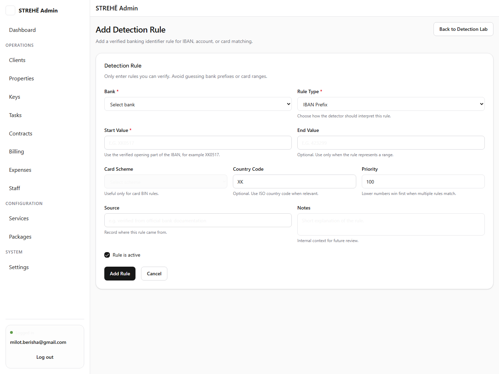

- File: `screenshots/settings-banking-rule-new.png`
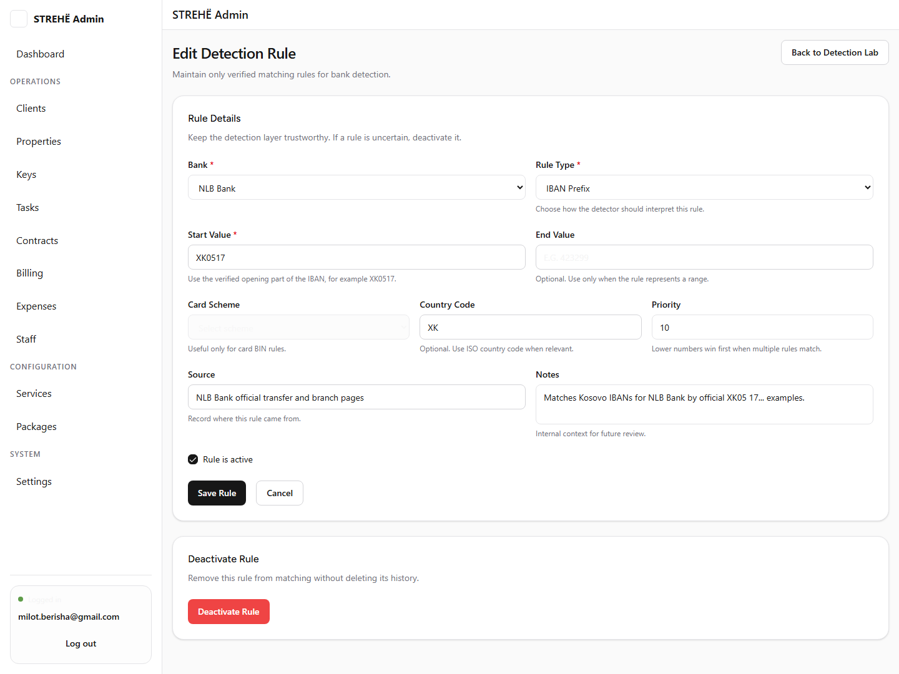

- File: `screenshots/settings-banking-rule-edit.png`

### 14.8 User Access Management

- **Route:** `/settings/users`
- **Who uses it:** admin
- **Page purpose:** modern user and access management page

### Main actions

- invite user
- resend invite
- send password reset
- change role
- activate/deactivate user
- review auth/account status

### Expected states shown

- invited
- password set / ready
- signed in
- missing auth record

### Important notes

- this is the primary user management page
- auth state is paginated and more scalable than the older `/users` route

### Screenshot slot

- File: `screenshots/settings-users.png`

### 14.9 Expense Categories

- **Routes:** `/settings/expense-categories`, `/settings/expense-categories/new`, `/settings/expense-categories/[id]/edit`
- **Who uses it:** admin
- **Page purpose:** controlled list of expense classifications

### Field reference

- **Category Name**
- **Description**
- **Sort Order**
- **Status**

### Screenshot slots

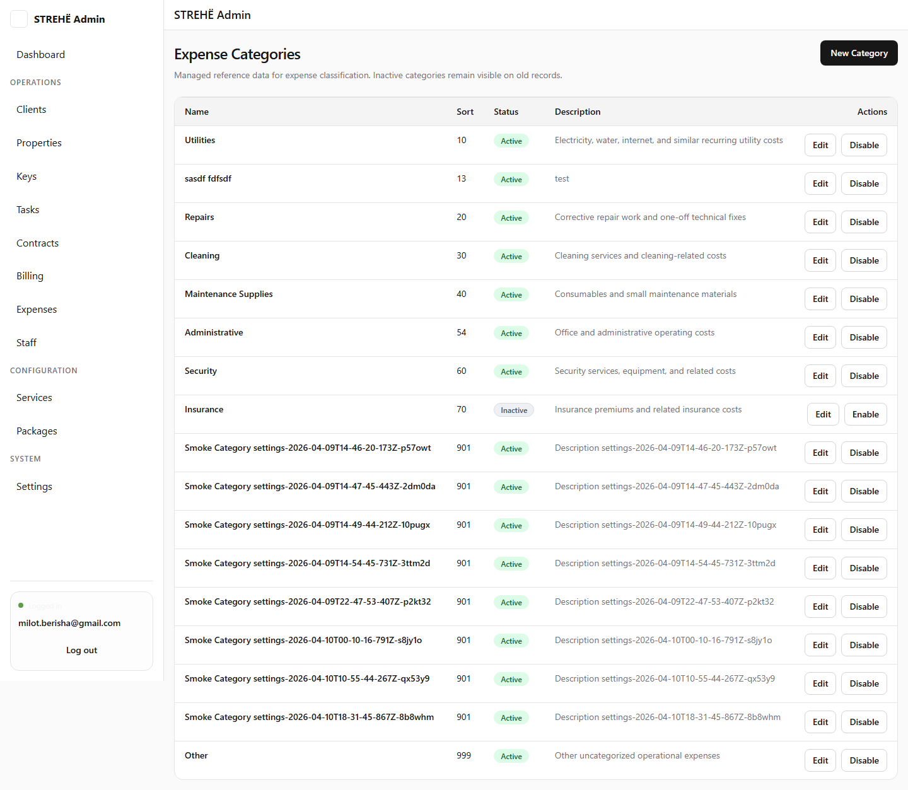

- File: `screenshots/settings-expense-categories-list.png`
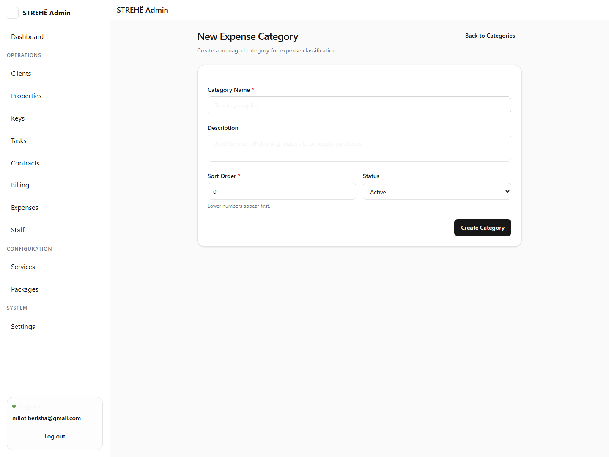

- File: `screenshots/settings-expense-categories-new.png`
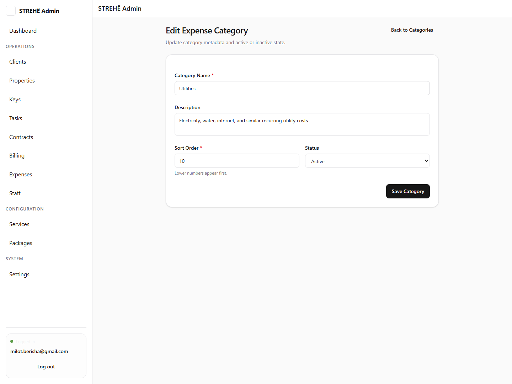

- File: `screenshots/settings-expense-categories-edit.png`

### 14.10 Vendors

- **Routes:** `/settings/vendors`, `/settings/vendors/new`, `/settings/vendors/[id]/edit`
- **Who uses it:** admin
- **Page purpose:** managed supplier/vendor list used by expenses

### Field reference

- **Vendor Name**
- **Contact Person**
- **Email**
- **Phone**
- **Address**
- **Notes**
- **Status**

### Screenshot slots

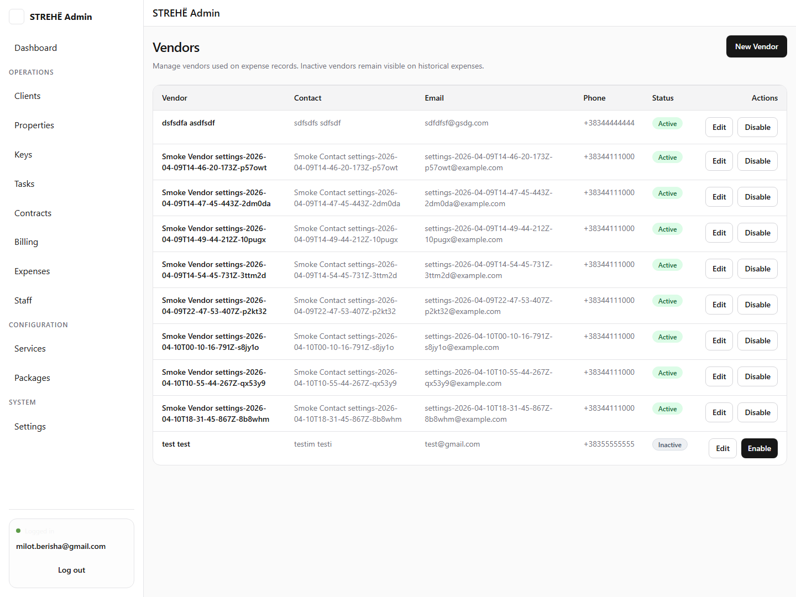

- File: `screenshots/settings-vendors-list.png`
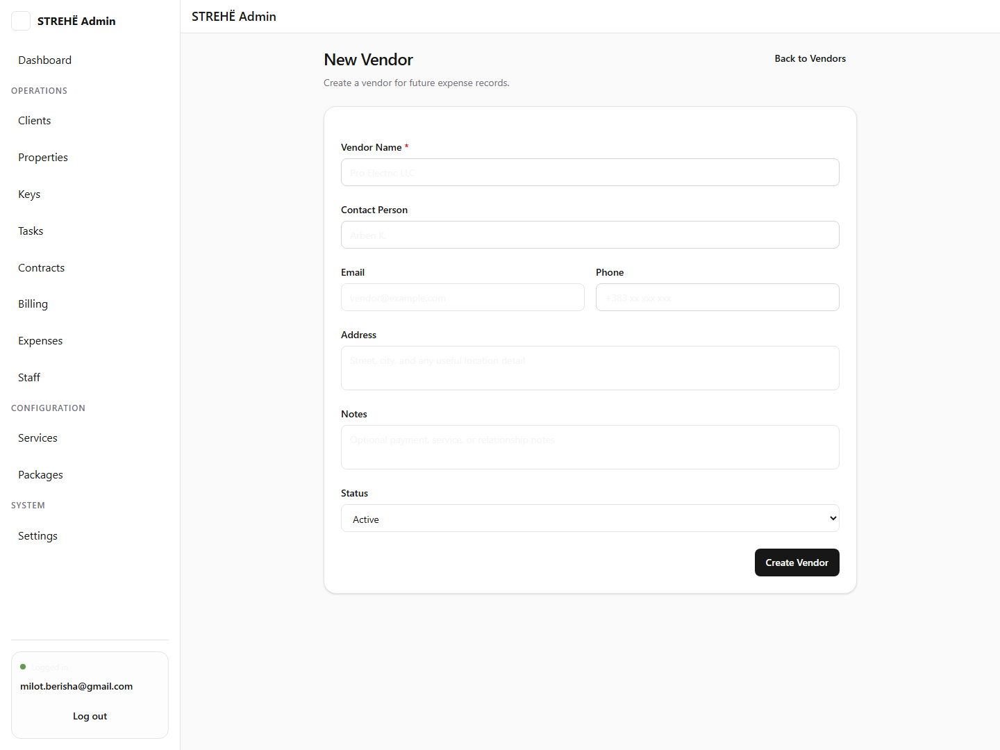

- File: `screenshots/settings-vendors-new.png`

- File: `screenshots/settings-vendors-edit.png`

### 14.11 Appearance Editor

- **Route:** `/ui-preview`
- **Who uses it:** admin
- **Page purpose:** shared visual theme editor for the whole app

### Main actions

- preview UI tokens
- adjust global theme colors
- save for everyone

### Important behavior

- the saved appearance theme is stored in the database
- all users receive the shared default

### Screenshot slot

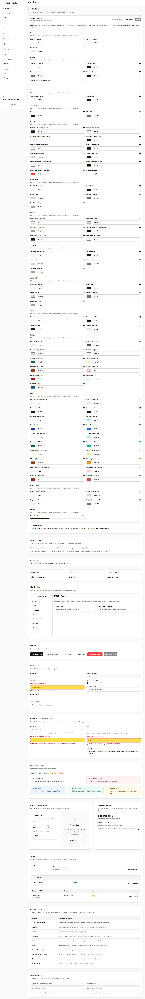

- File: `screenshots/settings-appearance-editor.png`

---

## 15. Secondary / Legacy Pages

These pages still exist but are not the preferred admin path for new day-to-day operations:

### 15.1 Users

- **Routes:** `/users`, `/users/create`, `/users/[id]`
- **Current behavior:** all three routes redirect to `/settings/users`
- **Recommendation:** use `/settings/users` for the real production user workflow

### Screenshot slots

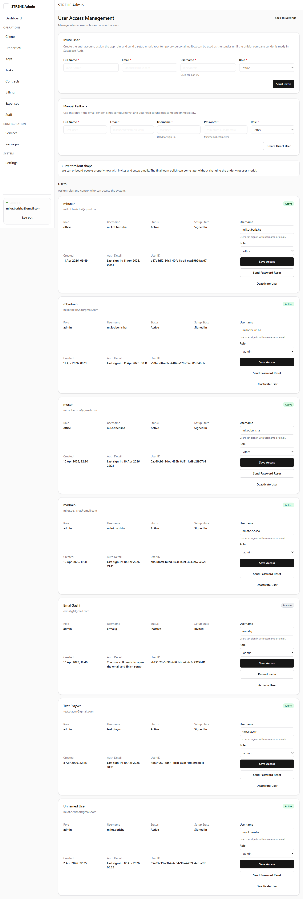

- File: `screenshots/users-legacy-list.png`

- File: `screenshots/users-legacy-create.png`

- File: `screenshots/users-legacy-detail.png`

---

## 16. Access Denied Screen

### 16.1 Unauthorized

- **Route:** `/unauthorized`
- **Who uses it:** any user redirected away from a page without permission
- **Page purpose:** explain that the current role cannot enter that area

### Screenshot slot

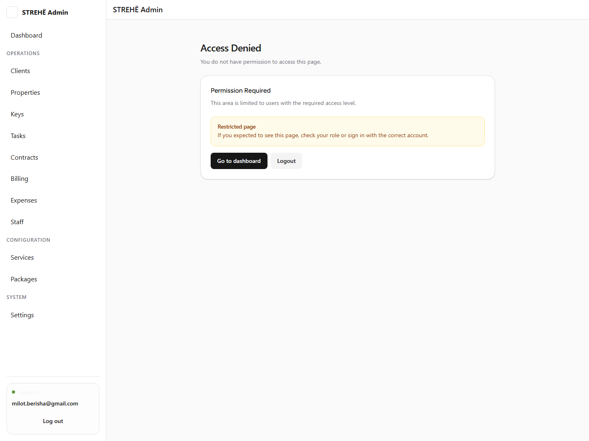

- File: `screenshots/unauthorized.png`

---

## Appendix A: Screenshot Capture Checklist

Use this list to verify and maintain the screenshot pack for the manual:

1. Confirm the admin screenshot pack still matches the current UI
2. Re-capture changed screens after significant UI or workflow changes
3. Capture the field/contractor dashboard once an active non-admin operational account exists
4. Save or replace files in `docs/manuals/screenshots/`

### Recommended screenshot naming

- `auth-login.png`
- `auth-setup-password.png`
- `dashboard-admin.png`
- `dashboard-field.png`
- `clients-list.png`
- `clients-new.png`
- `clients-detail.png`
- `clients-edit.png`
- `properties-list.png`
- `properties-new.png`
- `properties-detail.png`
- `properties-edit.png`
- `properties-keys-list.png`
- `properties-keys-new.png`
- `tasks-list.png`
- `tasks-new.png`
- `tasks-detail.png`
- `tasks-edit.png`
- `tasks-report.png`
- `keys-list.png`
- `keys-detail.png`
- `contracts-list.png`
- `contracts-new.png`
- `contracts-detail.png`
- `contracts-edit.png`
- `billing-list.png`
- `billing-new.png`
- `billing-detail.png`
- `billing-edit.png`
- `billing-record-payment.png`
- `billing-payments-history.png`
- `billing-credit-note-new.png`
- `expenses-list.png`
- `expenses-new.png`
- `expenses-detail.png`
- `expenses-edit.png`
- `finance-overview.png`
- `services-list.png`
- `services-new.png`
- `services-detail.png`
- `services-edit.png`
- `packages-list.png`
- `packages-new.png`
- `packages-detail.png`
- `packages-edit.png`
- `workers-list.png`
- `workers-new.png`
- `workers-detail.png`
- `settings-hub.png`
- `settings-general.png`
- `settings-banking.png`
- `settings-banking-account-new.png`
- `settings-banking-account-edit.png`
- `settings-banking-bank-new.png`
- `settings-banking-bank-edit.png`
- `settings-banking-detection.png`
- `settings-banking-rule-new.png`
- `settings-banking-rule-edit.png`
- `settings-users.png`
- `settings-expense-categories-list.png`
- `settings-expense-categories-new.png`
- `settings-expense-categories-edit.png`
- `settings-vendors-list.png`
- `settings-vendors-new.png`
- `settings-vendors-edit.png`
- `settings-appearance-editor.png`
- `unauthorized.png`

---

## Appendix B: Recommended Next Documentation Step

The next best step is a **manual polish pass**, not a first capture pass.

Recommended follow-up:

- create one active `field` or `contractor` user so the role-specific dashboard can be captured
- refresh screenshots whenever a page title, major form, or admin workflow changes
- consider a slim quick-start guide derived from this full manual for onboarding day one users
